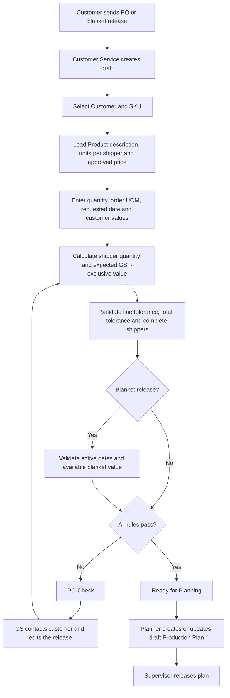
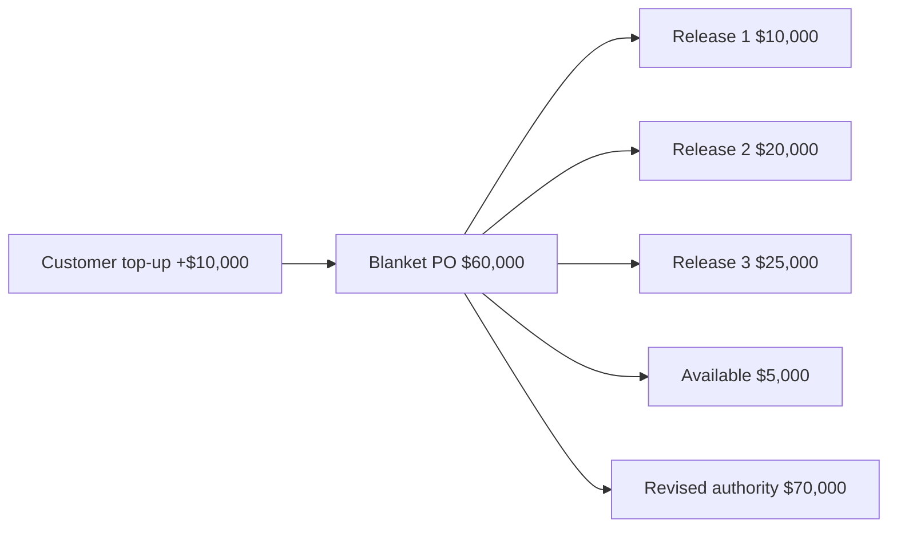
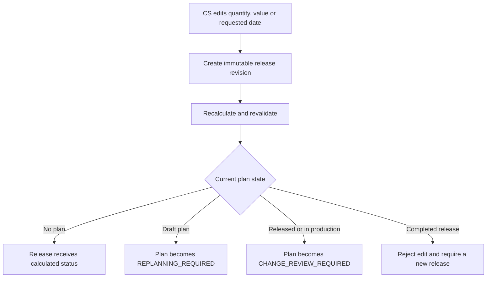
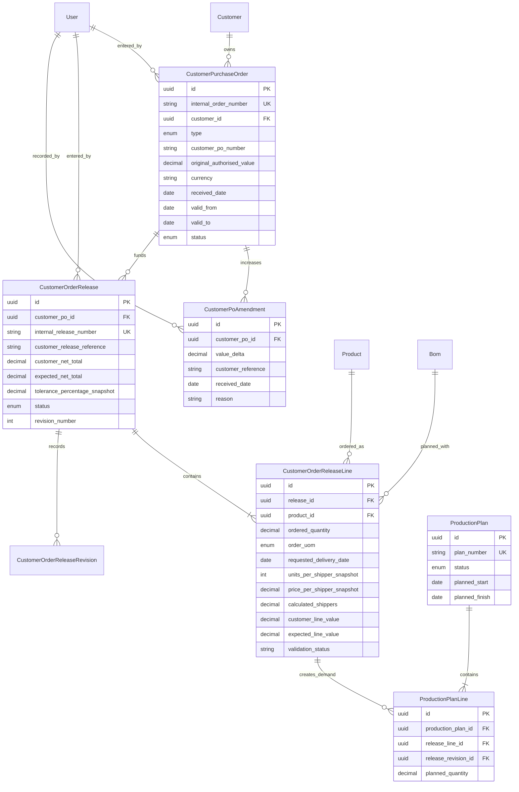

# Customer Orders and Production Planning Workflow

Status: Phase 1 domain and database foundation implemented; UI not started
Owner: Product owner / Customer Service / Production Planning
Last updated: 2026-09-14

## 1. Purpose

This document defines how a customer purchase order becomes validated demand
and then enters Production Planning. It covers normal customer POs, value-only
blanket POs, releases against blanket POs, price and quantity validation,
customer-funded PO amendments, and the effect of Customer Service changes on
production plans.

This is a customer-order workflow. It is not the future Procurement workflow
for purchase orders sent to suppliers.

## 2. Confirmed decisions

1. Customer Service receives customer POs and releases, normally by email, and
   enters them into the ERP.
2. Sales and Finance do not routinely review or approve customer POs.
3. Product pricing is approved upstream during Product setup. Order validation
   uses the current approved Product price.
4. The current approved price is copied onto the release line as a snapshot.
   Later Product price changes do not rewrite earlier releases.
5. Customer Service may enter quantities in individual units or shippers.
6. The system converts units to shippers using the Product's Units per Shipper.
7. A quantity that does not resolve to complete shippers puts the line and its
   release into `PO_CHECK`.
8. GST is excluded from Product prices, customer-stated values, calculated
   values, tolerance comparisons, and blanket balances.
9. The company controls the permitted percentage variance. Validation checks
   both each line and the complete release total.
10. A failed line puts that release into `PO_CHECK`. A `PO_CHECK` release cannot
    enter Production Planning.
11. Customer Service contacts the customer and corrects the quantity, dates, or
    customer-stated value. There is no manager override or approval path.
12. When every rule passes, the system automatically marks the release
    `READY_FOR_PLANNING`.
13. Different SKU lines may have different requested delivery dates.
14. A customer release reference is optional. The ERP always generates an
    internal release number.
15. A blanket PO is limited by authorised net value only. It does not restrict
    SKUs or quantities.
16. A blanket PO may receive multiple releases throughout its active period,
    which may be six months, one year, or another stated period.
17. The customer may increase an existing blanket PO through a documented
    top-up. The original authorised amount is retained and an amendment is
    appended.
18. Customer Service may change an uncompleted release. The system revalidates
    it and preserves its change history.
19. Changes affecting an existing production plan make that plan require
    replanning or operational change review; they never silently rewrite the
    plan's original demand snapshot.
20. Completed releases are locked. Further demand is entered as a new release.
21. The rollout tolerance defaults to `0%` until an authorised administrator
    deliberately configures another percentage.

## 3. Terminology

| Term | Meaning |
| --- | --- |
| Customer PO | The customer's commercial authority for the manufacturer to supply goods |
| Standard PO | A customer PO containing defined SKU quantities and normally one delivery release |
| Blanket PO | A value-only customer PO that funds multiple releases during a validity period |
| Release / call-off | A customer's instruction to produce specified SKUs and quantities against a blanket PO |
| Supplier PO | A future Procurement document sent by the company to a supplier; outside this workflow |
| Customer-stated value | The GST-exclusive amount written on the customer's PO or release |
| System-expected value | The GST-exclusive amount calculated from approved Product price and shipper quantity |
| Committed value | System-expected value of releases that reached `READY_FOR_PLANNING` and have not been cancelled |
| Available blanket value | Current authorised value minus committed value |
| PO Check | A blocking validation state requiring Customer Service correction |

The application should label the module **Customer Orders**. It may display
"Customer PO" on fields and documents, but it must reserve **Supplier Purchase
Orders** for the future Procurement module.

## 4. Scope

### Included in the first usable module

- Standard and blanket Customer PO headers.
- Multi-line releases.
- Optional customer release references and generated internal numbers.
- Unit/shipper conversion.
- Current approved price snapshots.
- Line and release-total variance checks.
- Company-configured percentage tolerance.
- GST-exclusive calculations.
- Blanket value consumption, remaining balance, and top-ups.
- Automatic `PO_CHECK` and `READY_FOR_PLANNING` classification.
- Customer Service corrections with history.
- Handoff of valid release lines into Production Planning.
- Draft Production Plans and replanning signals.

### Deferred

- Supplier purchasing and procurement approvals.
- Customer email ingestion or OCR.
- Customer-facing portal entry.
- Production-floor execution and labour reporting.
- Material requirements planning and inventory allocation.
- Dispatch, invoicing, credit notes, and accounts-receivable posting.
- Detailed finite-capacity scheduling across machines and shifts.

## 5. Roles and responsibilities

| Role | Responsibility |
| --- | --- |
| Customer Service | Enter Customer POs/releases, correct PO Check items, record top-ups, revise uncompleted demand, and cancel when instructed |
| Production Planner | View ready demand, create/split plans, choose planned dates, and respond to replanning requirements |
| Production Supervisor | Review and release production plans; handle operational effects of changes after release |
| Operations Manager | View Customer Orders and Production Plans; no routine customer-PO approval |
| Sales / Finance | Maintain or participate in upstream commercial decisions as defined elsewhere; no routine customer-PO check |
| Other authorised operational roles | Read-only visibility where the permission matrix permits it |

An operational review of a changed production plan is not a customer-PO price
approval. Customer Service remains responsible for correcting customer-facing
order information.

## 6. End-to-end workflow



## 7. Standard PO behaviour

A Standard PO contains defined order lines and behaves as one primary release.
It may contain multiple SKUs and different requested delivery dates per line.

1. Customer Service records the customer PO reference and received date.
2. Customer Service adds one or more SKU lines.
3. Each line is independently calculated and validated.
4. The system validates the sum of all customer-stated line values against the
   customer-stated PO total.
5. Any failed line or total check sets the Standard PO's primary release to
   `PO_CHECK`.
6. When every check passes, the primary release becomes
   `READY_FOR_PLANNING`.

There is no partial planning of a failed Standard PO in version 1. The UI shows
which lines passed and which failed, but the primary release remains blocked
until Customer Service corrects it.

## 8. Blanket PO behaviour

A Blanket PO is an authorisation envelope, not a production instruction. It
contains:

- customer;
- customer PO number;
- original GST-exclusive authorised value;
- currency;
- received date;
- valid-from and expiry dates; and
- current lifecycle status.

It does not contain an approved SKU list or quantity ceiling. Customer Service
creates separate releases as the customer calls off demand. Only releases enter
Production Planning; the blanket header itself never does.



### 8.1 Value consumption

```text
current authorised value = original value + sum of active amendments
committed value = sum of system-expected values for non-cancelled committed releases
available value = current authorised value - committed value
```

A release consumes blanket value when it becomes `READY_FOR_PLANNING`.
`DRAFT` and `PO_CHECK` releases consume nothing. Cancelling a committed release
returns its committed value unless later invoicing rules prevent that reversal.

The committed amount is the system-expected value because the approved Product
price is authoritative. The customer-stated value and variance remain stored
for reconciliation.

### 8.2 Concurrent releases

The final balance check and commitment must occur in one serializable database
transaction. Two users submitting releases at the same time must not both spend
the same remaining blanket balance.

## 9. Blanket amendments and top-ups

The original Blanket PO value is immutable after activation. A customer top-up
creates an amendment containing:

- signed amount change, initially limited to positive top-ups;
- customer amendment or communication reference when provided;
- date received and effective date;
- Customer Service actor;
- explanation or notes;
- previous and resulting authorised values; and
- optional future attachment reference.

Example:

```text
Original authorised value       $60,000
Amendment 1                     +$10,000
Current authorised value         $70,000
Committed releases               $63,000
Available value                   $7,000
```

Top-up history must not be replaced by editing the original value. If a top-up
allows a previously blocked release to fit within the available balance, the
system revalidates that release. It becomes `READY_FOR_PLANNING` only if all
other quantity, date, price, line, and total checks also pass.

Negative reductions remain a future decision because a reduction must never
drop authority below already committed or invoiced value.

## 10. Release inputs and calculated fields

### 10.1 Header inputs

| Field | Entry | Rule |
| --- | --- | --- |
| Customer | Customer Service | Must be active |
| Parent Customer PO | Customer Service/system | Required for blanket releases |
| Customer release reference | Customer Service | Optional |
| Internal release number | System | Required and unique |
| Received date | Customer Service | Required |
| Default requested delivery date | Customer Service | Optional when every line has a date |
| Customer-stated net total | Customer Service | Required; excludes GST |
| Currency | System/Customer Service | Defaults from Customer/PO and must match supported currency |
| Notes | Customer Service | Optional and bounded |

### 10.2 Line inputs and snapshots

| Field | Source | Rule |
| --- | --- | --- |
| Product/SKU | Customer Service | Active and assigned to the selected Customer |
| Description | Product snapshot | Read-only on release |
| Ordered quantity | Customer Service | Positive |
| Order UOM | Customer Service | `UNIT` or `SHIPPER` in version 1 |
| Requested delivery date | Customer Service | Required directly or inherited from release default |
| Customer-stated line value | Customer Service | Required; excludes GST |
| Units per shipper | Product snapshot | Positive integer required |
| Price per shipper | Product snapshot | Positive current approved price required |
| Calculated shippers | System | Must resolve to a complete shipper count |
| Expected net value | System | Calculated in currency decimals |
| Variance amount/percentage | System | Stored validation evidence |
| Active BOM revision | System snapshot at planning handoff | Required before planning |

## 11. Calculations and validation

### 11.1 Quantity conversion

```text
when UOM = UNIT:
calculated shippers = ordered units / units per shipper

when UOM = SHIPPER:
calculated shippers = ordered shippers

expected line value = calculated shippers x approved price per shipper
```

Example:

```text
2,400 units / 24 units per shipper = 100 shippers
100 shippers x $10.00 = $1,000.00 excluding GST
```

The application must use decimal money arithmetic rather than binary floating
point. It rounds each expected line value to the currency's supported decimal
places and then sums those rounded lines for the release total.

### 11.2 Percentage tolerance

```text
line variance = absolute(customer line value - expected line value)
line allowance = expected line value x configured tolerance percentage

total variance = absolute(customer release total - expected release total)
total allowance = expected release total x configured tolerance percentage
```

Both the line and total checks must pass. A percentage such as `0.5%` or `1%`
is company configuration, not a hard-coded workflow value. The effective
tolerance is saved on the release so later configuration changes do not rewrite
historical validation.

### 11.3 Blocking checks

A line or release becomes `PO_CHECK` when any applicable condition exists:

- inactive or unavailable Customer;
- inactive Product or Product assigned to another Customer;
- missing/invalid Units per Shipper;
- missing/non-positive approved price;
- missing active BOM revision;
- non-positive quantity;
- quantity does not resolve to complete shippers;
- missing requested delivery date;
- missing customer-stated line or release value;
- line price variance exceeds tolerance;
- release-total variance exceeds tolerance;
- expired or not-yet-active Blanket PO; or
- expected release value exceeds available Blanket PO value.

The UI must show a plain-language issue beside the affected line and a summary
at release level. There is no "approve anyway" control.

## 12. Price timing and snapshots

Because a Blanket PO has no SKU price schedule, each new release uses the
Product's current approved price when that release is entered or revalidated
after a commercial edit. The release stores that price as evidence.

- A later Product price change applies to future or deliberately revalidated
  draft demand.
- It does not change an already committed release.
- Editing quantity or replacing the customer-stated value before commitment
  reloads the current approved Product price and revalidates.
- Editing only a requested delivery date does not change the stored price
  snapshot unless the release is deliberately commercially revalidated.

Upstream price ownership and approval can evolve without adding an approval
step to Customer PO entry.

## 13. Status models

### 13.1 Customer PO status

| Status | Meaning |
| --- | --- |
| `DRAFT` | Header is being entered and cannot fund planning |
| `PO_CHECK` | Header-level information is incomplete or invalid |
| `ACTIVE` | Blanket PO may fund releases; Standard PO owns a valid primary release |
| `EXHAUSTED` | No usable Blanket PO balance remains |
| `EXPIRED` | Blanket validity period ended |
| `CLOSED` | Customer Service deliberately closed the remaining authority |
| `CANCELLED` | Customer cancelled the PO; history remains |

### 13.2 Release status

| Status | Meaning |
| --- | --- |
| `DRAFT` | Customer Service is entering or revising the release |
| `PO_CHECK` | One or more validation rules failed; planning is prohibited |
| `READY_FOR_PLANNING` | Validation passed and blanket value, when applicable, is committed |
| `PLANNING` | At least one draft Production Plan is being prepared |
| `PLANNED` | Required production quantity is covered by released plans |
| `IN_PRODUCTION` | Production execution started |
| `COMPLETED` | Required production/delivery workflow completed; release is locked |
| `CANCELLED` | Customer cancelled the release; retained for history |

### 13.3 Production Plan status

| Status | Meaning |
| --- | --- |
| `DRAFT` | Planner is preparing dates, quantities, and work breakdown |
| `REPLANNING_REQUIRED` | Customer Service changed the connected release after planning began |
| `RELEASED` | Supervisor authorised the plan for execution |
| `CHANGE_REVIEW_REQUIRED` | Demand changed after release or production start |
| `IN_PRODUCTION` | Execution began |
| `COMPLETED` | Planned work completed |
| `CANCELLED` | Plan was cancelled with history retained |

## 14. Changes after planning begins

Customer Service may correct an uncompleted customer release, but the ERP must
protect Production from silently using obsolete demand.



The operational planner or supervisor resolves the plan impact; they do not
approve the Customer PO price. Each Production Plan references the specific
release revision used to create it.

## 15. Conceptual data model



Final Prisma names and physical table names will be chosen during the schema
implementation. The conceptual separation is mandatory even if legacy table
names remain temporarily.

## 16. Permission boundary

The existing `purchase_order.*` permissions describe future supplier
Procurement and must not be reused for Customer Orders. Proposed stable keys:

- `customer_order.view`
- `customer_order.create`
- `customer_order.edit`
- `customer_order.cancel`
- `customer_order.blanket_amend`
- `customer_order.release.create`
- `customer_order.release.edit`
- `production_plan.view` (already registered)
- `production_plan.create` (already registered)
- `production_plan.release` (already registered)

The exact standard-role grants must be added to the role matrix in the same
increment as enforcement. UI visibility is never the only boundary; every
Server Action must re-authorise and validate its input.

## 17. Business audit requirements

The future operational audit catalogue should include:

- Customer PO created, activated, closed, expired, and cancelled.
- Blanket value increased, including previous and new authority.
- Release created and revised.
- Line validation failed and later passed.
- Release entered and left `PO_CHECK`.
- Blanket value committed and released.
- Release became ready for planning.
- Production Plan created, replanning required, released, changed, completed,
  and cancelled.

Events must include actor, target, timestamp, correlation ID, safe changed-field
names, and before/after commercial totals where appropriate. Uploaded customer
documents, email content, and unnecessary personal information must not be
copied into event metadata.

## 18. Pages and navigation

### Customer Orders

- `/customer-orders` - all Standard and Blanket POs.
- `/customer-orders/new` - choose Standard or Blanket and create a draft.
- `/customer-orders/[orderId]` - balances, releases, amendments, issues, and
  history.
- `/customer-orders/[orderId]/edit` - editable header fields.
- `/customer-orders/[orderId]/releases/new` - create a standard/blanket release.
- `/customer-orders/[orderId]/releases/[releaseId]` - lines, calculations,
  issues, revision history, and planning handoff.

### Production Planning

- `/production-planning` - ready demand and active plans.
- `/production-planning/new` - create a plan from selected ready release lines.
- `/production-planning/[planId]` - plan details, demand snapshot, dates,
  quantities, and lifecycle actions.

The first UI should use searchable tables with whole-row navigation, consistent
with Customers, Products, Parts, and BOMs.

## 19. Legacy data audit and migration boundary

The current physical `purchase_orders` table is actually legacy Customer Order
data. It is not a supplier-purchasing foundation.

Development database findings on 2026-09-14:

- 92 legacy order rows.
- 51 `Open`, 4 `PO Check`, 4 `PO Canceled`, and 33
  `Despatched/ Completed`.
- Every row links to a Product.
- No row has a Customer foreign key.
- 84 Customer links can likely be derived safely from the related Product.
- 8 Customer links require manual review.
- No row has a requested delivery date.
- The current unique PO-number design permits only one Product row per PO.
- There are 92 legacy status-history rows.
- 275 Products are active, while only 60 currently have positive planning-rate
  and Units-per-Shipper information.

Migration rules:

1. Add the normalized tables before changing or removing legacy structures.
2. Build a read-only dry-run report that maps every legacy row and reports every
   ambiguity.
3. Preserve the legacy row ID/reference on migrated records.
4. Derive Customer only when the Product relationship is unambiguous.
5. Route the other 8 rows to a manual mapping file or review screen.
6. Do not automatically mark legacy `Open` rows ready for planning because they
   have no requested delivery dates and have not passed the new validation.
7. Map legacy `PO Check` to `PO_CHECK`, cancelled to `CANCELLED`, and completed
   to historical `COMPLETED` only after record-level verification.
8. Keep the original table read-only until counts, totals, relationships, and
   status mappings reconcile.
9. Do not reuse `po_counters` without first proving its numbering rules suit
   Customer PO headers and releases.
10. Remove or archive legacy structures only in a later approved migration.

## 20. Implementation sequence

### Phase 1 - Domain and migration foundation

- **Implemented 2026-09-14.** Add enums, normalized Customer
  PO/release/line/amendment models, constraints,
  indexes, and relationships.
- Added company tolerance configuration with a safe `0%` rollout default.
- Implemented pure decimal conversion and validation rules.
- Added dry-run legacy mapping and reversible database UAT.
- Added Customer Order permission keys and standard-role grants.
- Added a serializable, parent-row-locked blanket commitment boundary.

### Phase 2 - Standard Customer PO entry

- Customer Order list, create, details, and edit pages.
- Multi-line Standard PO entry.
- Automatic line/total calculation and `PO_CHECK` classification.
- Correction workflow and immutable revision history.

### Phase 3 - Blanket POs and releases

- Blanket header, validity period, authorised value, and balance.
- Multiple releases with optional customer references.
- Atomic value commitment.
- Append-only top-up amendments.
- Cancellation and balance restoration rules.

### Phase 4 - Production Planning foundation

- Ready-demand queue.
- Draft Production Plans linked to release-line revisions.
- Quantity splitting across plans.
- Planned dates and calculated time from Product planning rates.
- Replanning/change-review signals.
- Supervisor release boundary.

### Phase 5 - Consolidated UAT

- Automated validation and transaction tests.
- Role allow/deny tests.
- Legacy migration reconciliation.
- Deferred manual scenarios in
  [Customer Orders and Production Planning Manual Tests](../testing/manual/customer-orders-production-planning.md).

## 21. Current implementation goal

Phase 1 is complete. The current goal is **Phase 2: Standard Customer PO
entry**. It will build the list, create, detail, correction, and cancellation
workflow on the tested calculation, status, permission, audit, and migration
boundaries.

## 22. Open future decisions

These do not block the initial domain foundation:

1. Whether blanket reductions are supported and how they interact with already
   committed/invoiced value.
2. Whether Customer PO and amendment documents are stored in the ERP or in an
   external document system.
3. Near-limit warning percentage for Blanket POs.
4. Detailed scheduling resources: machines, lines, shifts, crews, tooling, and
   changeover times.
5. Whether a Production Plan may combine demand from multiple Customers.
6. Inventory allocation and material-shortage behaviour.
7. Dispatch and invoicing rules that determine the final consumed blanket
   value.

## 23. Decision log

| Date | Decision | Reason |
| --- | --- | --- |
| 2026-09-14 | Customer Service owns Customer PO and release entry/correction without routine Sales, Finance, or manager approval. | Pricing is approved upstream and discrepancies must be corrected with the customer. |
| 2026-09-14 | Validate complete shippers, line price, and release total using company-configured percentage tolerance excluding GST. | Prevents invalid production quantities and hidden offsetting line errors. |
| 2026-09-14 | Use current approved Product price at entry and preserve a release-line snapshot. | Future price changes must not rewrite committed demand. |
| 2026-09-14 | Treat Blanket POs as value-only envelopes with multiple releases. | Customers may call off varying SKUs and quantities throughout a six- or twelve-month period. |
| 2026-09-14 | Preserve top-ups as append-only amendments. | The original authority and every later customer-funded increase must remain traceable. |
| 2026-09-14 | Allow CS edits to uncompleted demand while requiring replanning/change review after planning begins. | Customer requirements can change, but Production must not silently operate against stale demand. |
