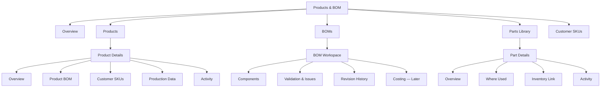
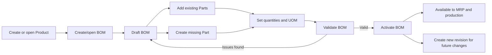
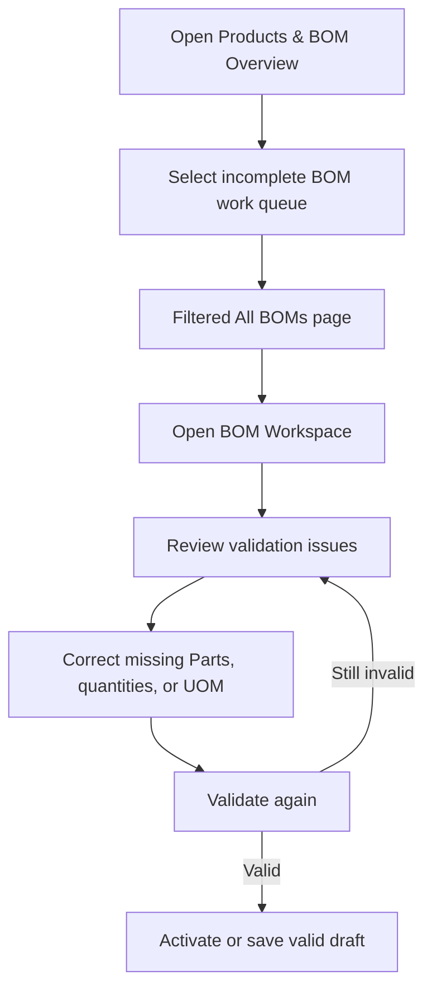
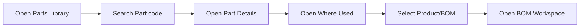
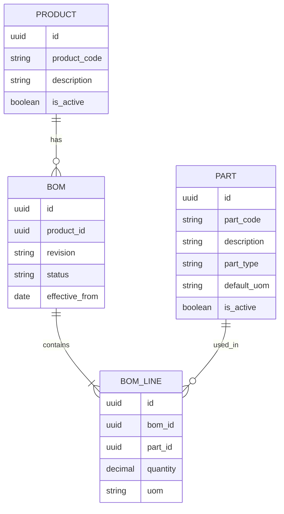

# Products & BOM Module — Workflow and Information Architecture

**Status:** Living design reference  
**Project phase:** Early implementation  
**Last updated:** 2026-09-08  
**Primary purpose:** Preserve the intended Products & BOM structure, the reasoning behind it, and the implementation sequence so development can continue across separate work sessions.

## 1. How to use this document

This document is a direction-setting reference, not a locked final specification. Update it when a business rule is confirmed or when implementation reveals that an assumption is incorrect.

When resuming work in a future session:

1. Read this document before changing Products, BOMs, Parts, or Customer SKU pages.
2. Check the "Open decisions" section before making a structural assumption.
3. Implement the smallest relevant phase from the roadmap.
4. Record material decisions in the decision log at the end of this file.

## 2. Scope

The Products & BOM module owns the master data required to describe what the business sells or manufactures and what is required to make it.

It includes:

- Product master records.
- Bills of Materials (BOMs).
- Reusable parts/components.
- The relationship between customers and their SKUs/products.
- Production-related product settings.
- BOM completeness and validation.
- Import/export entry points for this master data.

It does not own:

- Customer account administration; that belongs in Customer Master.
- Stock transactions and inventory movements; those belong in Inventory.
- Purchase-order processing; that belongs in Purchase Orders.
- Forecast calculations and MRP runs; those consume data from this module but belong in their own modules.

## 3. Current project state

The project currently has:

- A Products & BOM overview page at `src/app/(system)/products/page.tsx`.
- A completed first-layer Customers list page, with create/edit/deactivate operations still to be implemented.
- A first-layer Parts page backed by `bom_components`.
- A Prisma schema where BOM component rows attach directly to a product.
- No separate BOM header/revision model.
- No canonical reusable Part master model.

The important discovery is that the current Parts page is not yet a true Parts Library. It is closer to a list of component lines taken from product BOM data. Therefore, the current page should evolve into **All BOMs**, while a separate **Parts Library** should be introduced.

## 4. Core terminology

### Product

A finished good, saleable SKU, or manufactured item. A product may belong to or be configured for a customer and may have a BOM.

### BOM

A Bill of Materials describing the components and quantities required to produce a product. The BOM is the parent record; component rows are its lines.

### Part

A reusable material, packaging item, ingredient, subassembly, or other component. A part can be used by many BOMs.

### BOM line

The relationship between one BOM and one part. It stores BOM-specific information such as required quantity and unit of measure.

### Customer SKU

The customer's identifier or commercial relationship for a product. This is not the Customer Master record itself.

## 5. Design principles

### 5.1 Products, BOMs, and Parts are different records

They should not be represented by one table or one page:

- Products describe finished goods.
- BOMs describe how products are composed.
- Parts describe reusable inputs.
- BOM lines connect Parts to BOMs and hold the required quantity.

This separation prevents duplicated part descriptions and makes "Where Used" analysis possible.

### 5.2 Keep application navigation shallow

Only stable, frequently used list or overview pages belong in navigation. Create, edit, and record-detail pages should be reached through buttons, table rows, links, and breadcrumbs.

### 5.3 Use record pages for deep navigation

The sidebar should not contain several levels of nested entries. Once a user opens a Product, BOM, or Part, tabs and contextual links should expose related information.

### 5.4 Preserve historical operational data

Once a Product, BOM, or Part has been used by an operational transaction, it should normally be deactivated, archived, or superseded rather than physically deleted.

### 5.5 Build the simple lifecycle first

The first implementation may use one active BOM per Product and a small status set. Formal approval, effective dating, costing, and advanced revision control can be added after the core workflow works.

## 6. Proposed navigation hierarchy

### Recommended local navigation

Within the Products & BOM module, expose:

- Overview
- Products
- BOMs
- Parts
- Customer SKUs

Import/export may begin as a contextual action from the overview or list pages. It does not need to occupy permanent navigation unless users perform imports frequently.

## 7. Proposed route map

| Destination | Proposed route | Purpose |
| --- | --- | --- |
| Products & BOM overview | `/products` | Module health, work queues, and shortcuts |
| All Products | `/products/catalog` | Search and manage Product master records |
| New Product | `/products/catalog/new` | Create a Product |
| Product Details | `/products/catalog/[productId]` | View and maintain one Product |
| All BOMs | `/products/boms` | Search BOMs and identify missing/incomplete BOMs |
| New BOM | `/products/boms/new` | Create a BOM for a Product |
| BOM Workspace | `/products/boms/[bomId]` | Maintain components and validate a BOM |
| Parts Library | `/products/parts` | Search and manage reusable Parts |
| New Part | `/products/parts/new` | Create a Part |
| Part Details | `/products/parts/[partId]` | View the Part and where it is used |
| Customer SKUs | `/products/customer-skus` | Manage customer-to-product/SKU relationships |
| Import | `/products/import` | Preview, validate, and commit master-data imports |
| Customer Master | `/customers` | Manage customers outside the Products & BOM module |

Route names can change during implementation. The separation of responsibilities is more important than the exact URL.

## 8. Page responsibilities

### 8.1 Products & BOM Overview

The overview answers: **What needs attention in this module?**

Recommended content:

- Total Products.
- Active Products.
- Products with an active BOM.
- Products missing a BOM.
- Incomplete or invalid BOMs.
- Parts missing required master data.
- Recently updated Products/BOMs.
- An "Action Required" work queue linked to real filtered records.

Recommended actions:

- New Product.
- View All Products.
- View All BOMs.
- View Parts Library.
- Import Product/BOM/Part data.

The overview should not become the place where users perform detailed maintenance. It should summarize and route users to the appropriate workspace.

### 8.2 All Products

The Products page is the Product master list.

Suggested columns:

- Product code.
- Description.
- Customer or ownership relationship.
- Category.
- Default unit of measure.
- Active/inactive status.
- BOM status or health.
- Current BOM revision, when revisions are introduced.
- Last updated date.

Suggested filters:

- Customer.
- Active/inactive.
- Category.
- Has BOM / missing BOM.
- BOM health.

Selecting a row opens Product Details. Creation should begin from a clearly visible "New Product" action.

### 8.3 Product Details

Recommended sections or tabs:

#### Overview

- Product identity and description.
- Category and unit of measure.
- Active/inactive status.
- Customer relationship.
- Key production settings.
- Active BOM summary.

#### BOM

- Whether the Product has a BOM.
- Active BOM revision/status.
- Component count.
- Validation health.
- Action to create or open the BOM Workspace.

This tab should summarize the BOM rather than duplicate the full editor.

#### Customer SKUs

- Customer-specific code.
- Customer-specific description, when required.
- Commercial relationship and active state.

#### Production Data

- Units per shipper.
- Run rates.
- Minutes per shipper.
- Other planning parameters.

#### Activity

- Created/updated metadata.
- Later: audit history and significant lifecycle events.

### 8.4 All BOMs

The BOMs page represents one row per BOM, not one row per component.

Suggested columns:

- Product code.
- Product description.
- Customer.
- Revision, when enabled.
- BOM status.
- Component count.
- Validation health.
- Effective date, when enabled.
- Last updated date.

Suggested filters and work queues:

- Missing BOM.
- Incomplete BOM.
- Draft.
- Active.
- Archived or superseded.
- Customer.
- Product category.
- Updated date.

Selecting a row opens the BOM Workspace.

### 8.5 BOM Workspace

The BOM Workspace is where users build, inspect, validate, and later approve a BOM.

The header should show:

- Parent Product.
- Product description.
- BOM revision.
- Status.
- Effective date, when supported.
- Validation state.

The components table should eventually support:

- Part code.
- Part description.
- Part type.
- Required quantity.
- Unit of measure.
- Scrap/wastage percentage, if required.
- Active/inactive state.
- Validation messages.

Contextual actions:

- Add existing Part.
- Create a missing Part.
- Remove a draft BOM line.
- Validate BOM.
- Activate BOM.
- Archive or supersede BOM.
- Create a new revision later.

Clicking a Part code opens Part Details. The user should be able to return to the same BOM via breadcrumbs.

### 8.6 Parts Library

The Parts Library represents unique reusable Parts rather than BOM lines.

Suggested columns:

- Part code.
- Description.
- Part type.
- Default unit of measure.
- Active/inactive status.
- Number of BOMs using the Part.
- Stock-on-hand later, supplied by Inventory.
- Last updated date.

Suggested Part types may include:

- Raw material.
- Packaging.
- Ingredient.
- Component.
- Subassembly.
- Consumable.

These types must be confirmed against the actual business.

### 8.7 Part Details

Recommended sections or tabs:

#### Overview

- Part code and description.
- Type and default unit of measure.
- Active/inactive state.
- Other reusable master attributes.

#### Where Used

- Every Product/BOM that contains this Part.
- Quantity used in each BOM.
- BOM revision and status.
- Link to each BOM Workspace.

"Where Used" is the primary reason Parts need to be canonical reusable records.

#### Inventory

- Link or summary from the Inventory module.
- Stock-on-hand and locations later.

Inventory transactions should remain owned by the Inventory module.

#### Activity

- Created/updated metadata.
- Later: audit history.

### 8.8 Customer SKUs

Customer Master and Customer SKU mapping are separate concerns:

- `/customers` manages customer accounts and addresses.
- `/products/customer-skus` manages how customers identify or use Products.

Suggested mapping fields:

- Customer.
- Internal Product.
- Customer SKU/code.
- Customer description.
- Active/inactive state.
- Effective dates later, if needed.

If a Product can belong to only one Customer, the initial relationship can remain simple. If one Product can be sold to several Customers under different codes, a many-to-many mapping record will be required.

### 8.9 Import workflow

Imports should not immediately write uploaded data to production tables. Use a staged workflow:

1. Select file and import type.
2. Map file columns when needed.
3. Preview parsed records.
4. Validate required fields and references.
5. Show errors and warnings.
6. Commit valid records deliberately.
7. Show an import result and retain batch metadata.

The initial version can support one known template without a configurable mapping screen.

## 9. Primary user workflows

### 9.1 Create Product and activate its BOM

For the initial version, the final revision step can be postponed. The minimum useful workflow ends when a valid BOM becomes active.

### 9.2 Investigate an incomplete BOM

### 9.3 Find where a Part is used

The same Part Details page should also be accessible by clicking a Part code inside a BOM.

## 10. Recommended data model direction

### Why introduce a BOM header?

The current `bom_components` rows attach directly to Products. A BOM header provides a stable parent for:

- Status.
- Revision.
- Effective dates.
- Validation state.
- Approval metadata later.
- A component collection.
- Historical comparison.

Without a BOM header, these values would need to be duplicated on every component row or inferred indirectly.

### Why introduce a Part master?

Storing `part_code` and description directly on every BOM line can produce duplicated or inconsistent data. A canonical Part record provides:

- One source of truth for the Part code and description.
- A default unit of measure.
- Active/inactive control.
- "Where Used" queries.
- A future connection to Inventory and Purchasing.

### Why keep quantity on BOM Line?

The Part is reusable, but its required quantity differs by BOM. Quantity therefore belongs to the BOM-to-Part relationship, not to the Part master.

### Simplified first implementation

The first release can enforce one BOM per Product while still using separate `Bom`, `BomLine`, and `Part` models. This preserves a clean boundary and leaves room for revisions without requiring the complete revision workflow immediately.

## 11. BOM lifecycle

### Initial lifecycle

- **Draft:** Editable and unavailable to production/MRP.
- **Active:** Valid and available to downstream processes.
- **Archived:** Retained for reference but unavailable for new downstream use.

### Later lifecycle

- Draft.
- Pending Approval.
- Approved.
- Active.
- Superseded.
- Archived.

Activation should require validation. Once an active BOM has been consumed by operational data, future changes should create a new revision rather than silently rewriting history.

## 12. Initial validation rules

The first BOM validator should check:

- A parent Product exists and is active.
- At least one BOM line exists.
- Every BOM line references a valid Part.
- Every required quantity is greater than zero.
- A unit of measure is present.
- The same Part is not accidentally duplicated within the BOM.
- Inactive Parts are not added to a new or newly activated BOM.

Later validation may include:

- Unit-of-measure conversions.
- Circular references when subassemblies are supported.
- Effective-date overlaps.
- Approval requirements.
- Cost availability.
- Yield, scrap, or wastage rules.

## 13. Permissions direction

Detailed permissions will be defined when authentication and mutations are implemented. The module should nevertheless distinguish these capabilities:

- View Products, BOMs, and Parts.
- Create/edit Product master data.
- Create/edit Parts.
- Create/edit draft BOMs.
- Activate or approve BOMs.
- Archive master data.
- Import/export master data.

Activation/approval should be a separate permission from ordinary editing when formal controls are introduced.

## 14. Implementation roadmap

### Phase 1 — Confirm structure and preserve existing work

- Rename/reframe the current Parts concept as All BOMs where appropriate.
- Confirm whether the business initially needs one BOM per Product or multiple revisions.
- Confirm Part types and units of measure.
- Confirm whether Products can belong to multiple Customers.

### Phase 2 — Establish the domain model

- Introduce `Part` as a canonical master record.
- Introduce `Bom` as the BOM header.
- Introduce `BomLine` as the BOM-to-Part relationship.
- Plan how existing `bom_components` data will map into the new structure.
- Create a Prisma migration only after the mapping is understood.

### Phase 3 — All BOMs and BOM Workspace

- Build the BOM list with real health values.
- Build BOM Details/Workspace.
- Add and remove draft BOM lines.
- Select existing Parts.
- Set quantity and unit of measure.
- Add initial validation.
- Activate a valid BOM.

### Phase 4 — Parts Library

- Build the canonical Parts list.
- Add Part create/edit/deactivate flows.
- Build Part Details.
- Add Where Used.
- Link BOM lines to Part Details.

### Phase 5 — Product integration

- Build Product Details.
- Add the BOM summary tab.
- Link Product Details to the BOM Workspace.
- Replace mock overview metrics with real aggregate queries.
- Connect Customer SKU relationships.

### Phase 6 — Later controls

- BOM revisions.
- Approval lifecycle.
- Effective dating.
- Audit history.
- Cost rollups.
- Inventory and purchasing links.
- Advanced imports.

## 15. Minimum acceptance criteria for the first usable slice

The first Products/BOM slice is usable when a user can:

1. Create or select a Product.
2. Create a draft BOM for it.
3. Add existing Parts or create a missing Part.
4. Enter valid quantities and units of measure.
5. See clear validation errors.
6. Activate a valid BOM.
7. Find the BOM from All BOMs.
8. Open a Part and see which BOMs use it.
9. Deactivate/archive records without destroying operational history.

## 16. Open decisions

These questions must be answered through business use cases before the related advanced functionality is implemented:

1. Can a Product have more than one active BOM for different sites, customers, or production methods?
2. Are BOM revisions required in the first usable release?
3. Who may activate or approve a BOM?
4. Can one internal Product be sold to several Customers with different Customer SKU codes?
5. Are subassemblies treated as Parts, Products, or both?
6. What Part types does the business actually use?
7. Is quantity defined per finished unit, per shipper, per batch, or through several supported bases?
8. Are units of measure convertible, and where are conversion rules maintained?
9. What existing data must be migrated from `bom_components`?
10. When may a Product, BOM, BOM line, or Part be physically deleted versus archived?

Until confirmed, the lowest-risk assumptions are:

- One active BOM per Product.
- Quantity defined using an explicitly displayed basis and UOM.
- Draft/Active/Archived lifecycle.
- Parts are reusable across BOMs.
- Used master data is archived rather than deleted.

## 17. Decision log

| Date | Decision | Reason |
| --- | --- | --- |
| 2026-09-08 | Use Products & BOM as the umbrella module. | Products, BOMs, and Parts are closely related master data but remain distinct concepts. |
| 2026-09-08 | Replace the current top-level Parts interpretation with All BOMs. | Existing `bom_components` data represents BOM usage lines, not a canonical Parts Library. |
| 2026-09-08 | Keep Parts Library as a sibling of BOMs, accessible from BOM records. | A Part can be reused by multiple BOMs and needs its own identity and Where Used view. |
| 2026-09-08 | Keep Customer Master outside Products & BOM. | Customer administration differs from managing customer-to-product SKU relationships. |
| 2026-09-08 | Prefer a separate BOM header, BOM line, and Part master. | This supports validation, reuse, lifecycle control, Where Used, and later revisions without duplicating data. |

## 18. Relevant current files

- `src/app/(system)/products/page.tsx` — Products & BOM overview.
- `src/app/(system)/products/customers/page.tsx` — current Customers page location.
- `src/app/(system)/products/parts/page.tsx` — current first-layer Parts page.
- `src/features/products/` — Product feature implementation.
- `src/features/parts/` — current Part/BOM component feature implementation.
- `src/features/customers/` — Customer feature implementation.
- `prisma/schema.prisma` — current database schema and `bom_components` structure.

