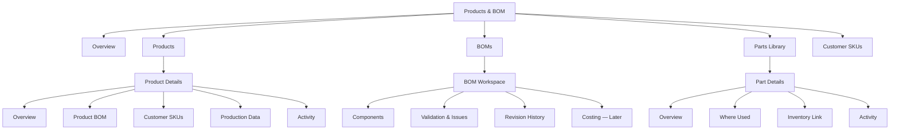
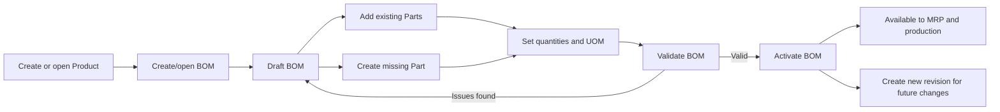
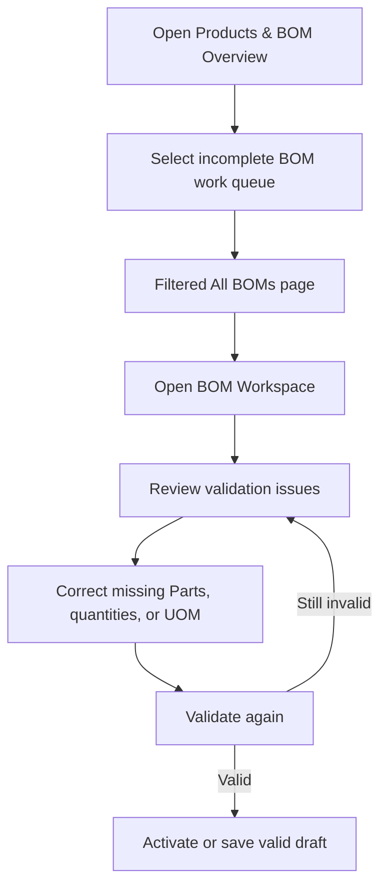
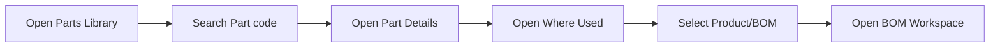
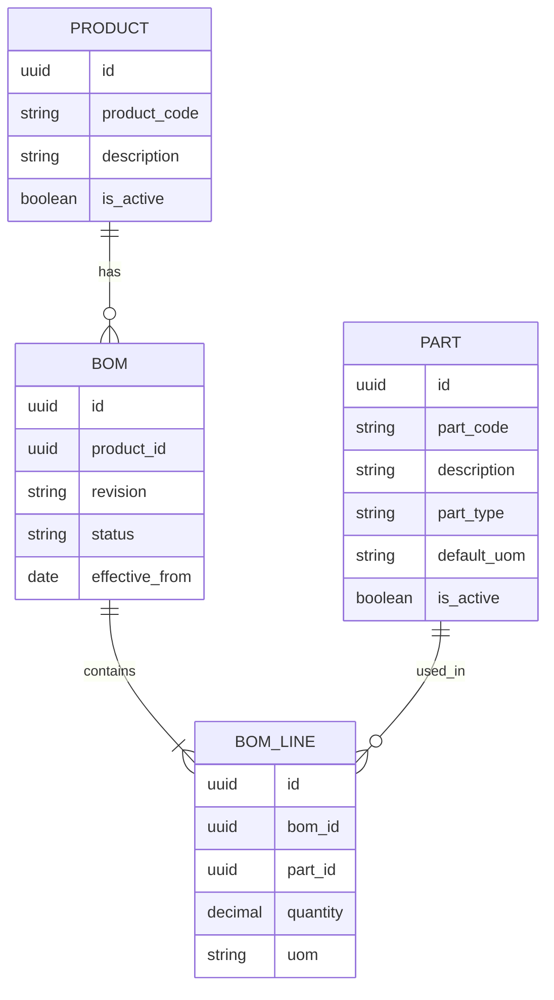

# Products & BOM Module — Workflow and Information Architecture

**Status:** Living design reference  
**Project phase:** Early implementation  
**Last updated:** 2026-09-09
**Primary purpose:** Preserve the intended Products & BOM structure, the reasoning behind it, and the implementation sequence so development can continue across separate work sessions.

## 1. How to use this document

This document is a direction-setting reference, not a locked final specification. Update it when a business rule is confirmed or when implementation reveals that an assumption is incorrect.

When resuming work in a future session:

1. Read this document before changing Products, BOMs, Parts, or Customer SKU pages.
2. Check the "Open decisions" section before making a structural assumption.
3. Implement the smallest relevant phase from the roadmap.
4. Record material decisions in the decision log at the end of this file.

## 2. Scope

The Products & BOM module owns the master data required to describe what the business sells or manufactures and what is required to make it.

It includes:

- Product master records.
- Bills of Materials (BOMs).
- Reusable parts/components.
- The relationship between customers and their SKUs/products.
- Production-related product settings.
- BOM completeness and validation.
- Import/export entry points for this master data.

It does not own:

- Customer account administration; that belongs in Customer Master.
- Stock transactions and inventory movements; those belong in Inventory.
- Purchase-order processing; that belongs in Purchase Orders.
- Forecast calculations and MRP runs; those consume data from this module but belong in their own modules.

## 3. Current project state

As of 2026-09-09, the normalized Product/BOM/Part navigation and the guarded BOM revision workflow are implemented:

- The Products & BOM overview uses real BOM health aggregates instead of mock figures.
- `/products/catalog` provides a server-backed Product Catalog with Product status and active-BOM filters.
- `/products/catalog/[productId]` provides Product Details, production fields, customer context, and BOM revision history.
- `/products/boms` lists one record per BOM.
- `/products/boms/[bomId]` provides a read-only BOM Workspace and component health.
- `/products/parts` is a canonical reusable Parts Library.
- `/products/parts/[partId]` provides Part Details and Where Used.
- `/products/customers` provides Customer list, create, detail, edit, and lifecycle workflows at its current route.
- The Prisma schema has separate `Bom`, `BomLine`, and `Part` models.
- The original `bom_components` table remains intact as a traceable legacy source.
- Prisma Migrate now has a baseline plus an additive normalization migration.
- Users can clone an active or archived BOM into one draft revision per Product.
- Draft BOM lines can be added from the active Parts Library, edited, and removed.
- Activation validates quantities, UOMs, duplicate Parts, active Parts, and Product state before atomically archiving the previous active revision.
- BOM mutations require an authenticated session; role-specific authorization remains future work.
- Products and Parts support authenticated create, edit, deactivate, and reactivate workflows.
- Creating a Product also creates its empty revision-1 draft BOM.
- `npm run uat:master-data` provides a repeatable transaction-rollback acceptance check for the core master-data and BOM relationship.
- Formal approval, role-specific permissions, and audit-history workflows remain future work.

### 3.1 Source-data audit and backfill result

The repeatable audit is available through `npm run audit:bom`.

| Measure | Result |
| --- | ---: |
| Products | 65 |
| Products with legacy component rows | 65 |
| Legacy component rows | 338 |
| Unique normalized Part codes | 240 |
| Unlinked component rows | 0 |
| Missing quantities | 0 |
| Non-positive quantities | 2 |
| Part codes with conflicting descriptions | 3 |
| Duplicate Part-within-Product groups | 5 |
| Normalized Parts after backfill | 240 |
| Normalized BOMs after backfill | 65 |
| Normalized BOM Lines after backfill | 338 |

The backfill deliberately retained the two zero quantities and five duplicate groups. They now appear as health issues rather than being silently corrected. For the three conflicting descriptions, the most frequently used description/type combination becomes the canonical Part value; ties prefer the longer description. Every original value remains in `bom_components` and every migrated BOM Line retains its `legacy_component_id`.

### 3.2 Cleaned customer BOM import result

On 2026-09-08, `Data files/All customer Bom - cleaned.xlsx` was validated, compared with Supabase, backed up, and imported in one serializable transaction.

The workbook is now the active normalized Product/BOM dataset:

| Measure | Active result |
| --- | ---: |
| Workbook customers matched | 28 |
| Products | 275 |
| Parts | 784 |
| BOMs | 275 |
| BOM Lines | 1,276 |
| Validation errors | 0 |
| Post-import creates, updates, or conflicts remaining | 0 |

Import actions:

- Created 215 Products and linked/updated 60 existing Products to their workbook Customers.
- Created 568 Parts and normalized five legacy Part codes.
- Created 216 BOMs with 980 BOM Lines; 59 existing BOMs remained unchanged.
- Archived six superseded or database-only BOMs and deactivated five database-only Products.
- Deactivated 24 database-only Parts that were not used by an active BOM.
- Filled 296 missing legacy BOM-Line UOM values with `Each`.
- Retained the two database-only Customer records; customer master data was not deleted.
- Retained all archived and legacy records for traceability.

`npm run import:bom:dry-run` is the repeatable, read-only consistency check. The guarded apply command requires the explicit `IMPORT-CUSTOMER-BOMS` confirmation token. Pre-import snapshots and result reports are written to the git-ignored `Data files/backups/` directory.

## 4. Core terminology

### Product

A finished good, saleable SKU, or manufactured item. A product may belong to or be configured for a customer and may have a BOM.

### BOM

A Bill of Materials describing the components and quantities required to produce a product. The BOM is the parent record; component rows are its lines.

### Part

A reusable material, packaging item, ingredient, subassembly, or other component. A part can be used by many BOMs.

### BOM line

The relationship between one BOM and one part. It stores BOM-specific information such as required quantity and unit of measure.

### Customer SKU

The customer's identifier or commercial relationship for a product. This is not the Customer Master record itself.

## 5. Design principles

### 5.1 Products, BOMs, and Parts are different records

They should not be represented by one table or one page:

- Products describe finished goods.
- BOMs describe how products are composed.
- Parts describe reusable inputs.
- BOM lines connect Parts to BOMs and hold the required quantity.

This separation prevents duplicated part descriptions and makes "Where Used" analysis possible.

### 5.2 Keep application navigation shallow

Only stable, frequently used list or overview pages belong in navigation. Create, edit, and record-detail pages should be reached through buttons, table rows, links, and breadcrumbs.

### 5.3 Use record pages for deep navigation

The sidebar should not contain several levels of nested entries. Once a user opens a Product, BOM, or Part, tabs and contextual links should expose related information.

### 5.4 Preserve historical operational data

Once a Product, BOM, or Part has been used by an operational transaction, it should normally be deactivated, archived, or superseded rather than physically deleted.

### 5.5 Build the simple lifecycle first

The first implementation may use one active BOM per Product and a small status set. Formal approval, effective dating, costing, and advanced revision control can be added after the core workflow works.

## 6. Proposed navigation hierarchy

### Recommended local navigation

Within the Products & BOM module, expose:

- Overview
- Products
- BOMs
- Parts
- Customer SKUs

Import/export may begin as a contextual action from the overview or list pages. It does not need to occupy permanent navigation unless users perform imports frequently.

## 7. Proposed route map

| Destination | Proposed route | Purpose |
| --- | --- | --- |
| Products & BOM overview | `/products` | Module health, work queues, and shortcuts |
| All Products | `/products/catalog` | Search and manage Product master records |
| New Product | `/products/catalog/new` | Create a Product |
| Product Details | `/products/catalog/[productId]` | View and maintain one Product |
| All BOMs | `/products/boms` | Search BOMs and identify missing/incomplete BOMs |
| New BOM | `/products/boms/new` | Create a BOM for a Product |
| BOM Workspace | `/products/boms/[bomId]` | Maintain components and validate a BOM |
| Parts Library | `/products/parts` | Search and manage reusable Parts |
| New Part | `/products/parts/new` | Create a Part |
| Part Details | `/products/parts/[partId]` | View the Part and where it is used |
| Customer SKUs | `/products/customer-skus` | Manage customer-to-product/SKU relationships |
| Import | `/products/import` | Preview, validate, and commit master-data imports |
| Customer Master | `/customers` | Manage customers outside the Products & BOM module |

Route names can change during implementation. The separation of responsibilities is more important than the exact URL.

## 8. Page responsibilities

### 8.1 Products & BOM Overview

The overview answers: **What needs attention in this module?**

Recommended content:

- Total Products.
- Active Products.
- Products with an active BOM.
- Products missing a BOM.
- Incomplete or invalid BOMs.
- Parts missing required master data.
- Recently updated Products/BOMs.
- An "Action Required" work queue linked to real filtered records.

Recommended actions:

- New Product.
- View All Products.
- View All BOMs.
- View Parts Library.
- Import Product/BOM/Part data.

The overview should not become the place where users perform detailed maintenance. It should summarize and route users to the appropriate workspace.

### 8.2 All Products

The Products page is the Product master list.

Suggested columns:

- Product code.
- Description.
- Customer or ownership relationship.
- Category.
- Default unit of measure.
- Active/inactive status.
- BOM status or health.
- Current BOM revision, when revisions are introduced.
- Last updated date.

Suggested filters:

- Customer.
- Active/inactive.
- Category.
- Has BOM / missing BOM.
- BOM health.

Selecting a row opens Product Details. Creation should begin from a clearly visible "New Product" action.

The current implementation keeps Product codes immutable after creation and
enforces case- and whitespace-insensitive uniqueness in PostgreSQL. Users can
maintain the Customer assignment, packaging data, category, pricing, and
production-planning values.

Product deactivation is a soft lifecycle operation. It is blocked while the
Product has a purchase order in `Open` or `PO Check`. Otherwise, the same
serializable transaction deactivates the Product and archives its active and
draft BOM revisions. Reactivation does not restore an old operational BOM; the
user prepares and activates a new draft when the Product is ready again.

### 8.3 Product Details

Recommended sections or tabs:

#### Overview

- Product identity and description.
- Category and unit of measure.
- Active/inactive status.
- Customer relationship.
- Key production settings.
- Active BOM summary.

#### BOM

- Whether the Product has a BOM.
- Active BOM revision/status.
- Component count.
- Validation health.
- Action to create or open the BOM Workspace.

This tab should summarize the BOM rather than duplicate the full editor.

#### Customer SKUs

- Customer-specific code.
- Customer-specific description, when required.
- Commercial relationship and active state.

#### Production Data

- Units per shipper.
- Run rates.
- Minutes per shipper.
- Other planning parameters.

#### Activity

- Created/updated metadata.
- Later: audit history and significant lifecycle events.

### 8.4 All BOMs

The BOMs page represents one row per BOM, not one row per component.

Suggested columns:

- Product code.
- Product description.
- Customer.
- Revision, when enabled.
- BOM status.
- Component count.
- Validation health.
- Effective date, when enabled.
- Last updated date.

Suggested filters and work queues:

- Missing BOM.
- Incomplete BOM.
- Draft.
- Active.
- Archived or superseded.
- Customer.
- Product category.
- Updated date.

Selecting a row opens the BOM Workspace.

### 8.5 BOM Workspace

The BOM Workspace is where users build, inspect, validate, and later approve a BOM.

The header should show:

- Parent Product.
- Product description.
- BOM revision.
- Status.
- Effective date, when supported.
- Validation state.

The components table should eventually support:

- Part code.
- Part description.
- Part type.
- Required quantity.
- Unit of measure.
- Scrap/wastage percentage, if required.
- Active/inactive state.
- Validation messages.

Contextual actions:

- Add existing Part.
- Create a missing Part.
- Remove a draft BOM line.
- Validate BOM.
- Activate BOM.
- Archive or supersede BOM.
- Create a new revision later.

Clicking a Part code opens Part Details. The user should be able to return to the same BOM via breadcrumbs.

### 8.6 Parts Library

The Parts Library represents unique reusable Parts rather than BOM lines.

The current core workflow supports creating a Part, editing its descriptive
master data, and deactivating or reactivating it. Part codes are immutable
after creation because BOM history and integrations use them as stable
identifiers. A normalized uppercase code prevents duplicates caused by letter
case or repeated whitespace.

Deactivation is a soft lifecycle change, not deletion. It is blocked while the
Part is used in any active BOM. The user must first create and activate revised
BOMs that no longer use the Part. Inactive Parts remain visible in history and
Where Used, but are excluded from the active Part picker for draft BOM lines.

Suggested columns:

- Part code.
- Description.
- Part type.
- Default unit of measure.
- Active/inactive status.
- Number of BOMs using the Part.
- Stock-on-hand later, supplied by Inventory.
- Last updated date.

Suggested Part types may include:

- Raw material.
- Packaging.
- Ingredient.
- Component.
- Subassembly.
- Consumable.

These types must be confirmed against the actual business.

### 8.7 Part Details

Recommended sections or tabs:

#### Overview

- Part code and description.
- Type and default unit of measure.
- Active/inactive state.
- Other reusable master attributes.

#### Where Used

- Every Product/BOM that contains this Part.
- Quantity used in each BOM.
- BOM revision and status.
- Link to each BOM Workspace.

"Where Used" is the primary reason Parts need to be canonical reusable records.

#### Inventory

- Link or summary from the Inventory module.
- Stock-on-hand and locations later.

Inventory transactions should remain owned by the Inventory module.

#### Activity

- Created/updated metadata.
- Later: audit history.

### 8.8 Customer SKUs

Customer Master and Customer SKU mapping are separate concerns:

- `/products/customers` currently manages Customer accounts; it can move to `/customers` when the wider ERP navigation is reorganized.
- `/products/customer-skus` manages how customers identify or use Products.

Customer codes are immutable and normalized for case- and whitespace-insensitive
uniqueness. Deactivation is blocked while the Customer owns active Products or
has a purchase order in `Open` or `PO Check`. This avoids silently changing
downstream Product and order state. Address-book CRUD remains a later,
independent workflow because each Customer can own multiple shipping and
billing addresses.

Suggested mapping fields:

- Customer.
- Internal Product.
- Customer SKU/code.
- Customer description.
- Active/inactive state.
- Effective dates later, if needed.

If a Product can belong to only one Customer, the initial relationship can remain simple. If one Product can be sold to several Customers under different codes, a many-to-many mapping record will be required.

### 8.9 Import workflow

Imports should not immediately write uploaded data to production tables. Use a staged workflow:

1. Select file and import type.
2. Map file columns when needed.
3. Preview parsed records.
4. Validate required fields and references.
5. Show errors and warnings.
6. Commit valid records deliberately.
7. Show an import result and retain batch metadata.

The initial version can support one known template without a configurable mapping screen.

## 9. Primary user workflows

### 9.1 Create Product and activate its BOM

For the initial version, the final revision step can be postponed. The minimum useful workflow ends when a valid BOM becomes active.

### 9.2 Investigate an incomplete BOM

### 9.3 Find where a Part is used

The same Part Details page should also be accessible by clicking a Part code inside a BOM.

## 10. Recommended data model direction

### Why introduce a BOM header?

The current `bom_components` rows attach directly to Products. A BOM header provides a stable parent for:

- Status.
- Revision.
- Effective dates.
- Validation state.
- Approval metadata later.
- A component collection.
- Historical comparison.

Without a BOM header, these values would need to be duplicated on every component row or inferred indirectly.

### Why introduce a Part master?

Storing `part_code` and description directly on every BOM line can produce duplicated or inconsistent data. A canonical Part record provides:

- One source of truth for the Part code and description.
- A default unit of measure.
- Active/inactive control.
- "Where Used" queries.
- A future connection to Inventory and Purchasing.

### Why keep quantity on BOM Line?

The Part is reusable, but its required quantity differs by BOM. Quantity therefore belongs to the BOM-to-Part relationship, not to the Part master.

### Simplified first implementation

The first release can enforce one BOM per Product while still using separate `Bom`, `BomLine`, and `Part` models. This preserves a clean boundary and leaves room for revisions without requiring the complete revision workflow immediately.

## 11. BOM lifecycle

### Initial lifecycle

- **Draft:** Editable and unavailable to production/MRP.
- **Active:** Valid and available to downstream processes.
- **Archived:** Retained for reference but unavailable for new downstream use.

### Later lifecycle

- Draft.
- Pending Approval.
- Approved.
- Active.
- Superseded.
- Archived.

Activation should require validation. Once an active BOM has been consumed by operational data, future changes should create a new revision rather than silently rewriting history.

## 12. Initial validation rules

The first BOM validator should check:

- A parent Product exists and is active.
- At least one BOM line exists.
- Every BOM line references a valid Part.
- Every required quantity is greater than zero.
- A unit of measure is present.
- The same Part is not accidentally duplicated within the BOM.
- Inactive Parts are not added to a new or newly activated BOM.

Later validation may include:

- Unit-of-measure conversions.
- Circular references when subassemblies are supported.
- Effective-date overlaps.
- Approval requirements.
- Cost availability.
- Yield, scrap, or wastage rules.

## 13. Permissions direction

The detailed, maintainable role catalogue and target authorization matrix are
defined in [`docs/auth/roles-and-permissions.md`](../auth/roles-and-permissions.md).
It records ten agreed business roles plus the technical System Administrator.

This module must distinguish these capabilities:

- View Products, BOMs, and Parts.
- Create/edit Product master data.
- Create/edit Parts.
- Create/edit draft BOMs.
- Activate or approve BOMs.
- Archive master data.
- Import/export master data.

Activation/approval should be a separate permission from ordinary editing when formal controls are introduced.

The current application enforces authentication for mutations but does not yet
enforce the target role-specific permissions. That gap must remain visible
until the authorization implementation and deny-path tests are complete.

## 14. Implementation roadmap

### Phase 1 — Confirm structure and preserve existing work — Complete

- Rename/reframe the current Parts concept as All BOMs where appropriate.
- Confirm whether the business initially needs one BOM per Product or multiple revisions.
- Confirm Part types and units of measure.
- Confirm whether Products can belong to multiple Customers.

### Phase 2 — Establish the domain model — Complete

- Introduce `Part` as a canonical master record.
- Introduce `Bom` as the BOM header.
- Introduce `BomLine` as the BOM-to-Part relationship.
- Plan how existing `bom_components` data will map into the new structure.
- Create a Prisma migration only after the mapping is understood.

### Phase 3 — All BOMs and BOM Workspace — Core workflow complete

- Build the BOM list with real health values.
- Build BOM Details/Workspace.
- Add and remove draft BOM lines.
- Select existing Parts.
- Set quantity and unit of measure.
- Add initial validation.
- Activate a valid BOM.
- Keep active and archived revisions immutable; changes begin by cloning a draft revision.
- Enforce one active and one draft revision per Product in both service logic and database indexes.

### Phase 4 — Parts Library — Core workflow complete

- Build the canonical Parts list.
- Add Part create/edit/deactivate flows.
- Build Part Details.
- Add Where Used.
- Link BOM lines to Part Details.
- Keep Part codes immutable after creation.
- Prevent deactivation while a Part is used in an active BOM.
- Require authentication for every Part mutation.

### Phase 5 — Product integration — Core workflow complete

- Build the Product Catalog and Product Details.
- Show the active BOM summary and revision history on Product Details.
- Link Product Details and the BOM Workspace in both directions.
- Replace mock overview metrics with real active-Product and active-BOM aggregates.
- Expose the current one-Customer-per-Product relationship from the imported data.
- Add authenticated Product create, edit, deactivate, and reactivate operations.
- Create an empty revision-1 draft BOM with each new Product.
- Keep Product codes immutable and enforce normalized uniqueness in the database.
- Block deactivation for open or pending purchase orders and archive operational BOM revisions otherwise.
- Add a separate many-to-many Customer SKU mapping later, if the business requires it.

### Phase 6 — Customer Master — Core workflow complete

- Build the Customer list and Customer Details view.
- Add authenticated create, edit, deactivate, and reactivate operations.
- Keep Customer codes immutable and enforce normalized uniqueness in PostgreSQL.
- Show assigned Products and live purchase-order counts.
- Block deactivation while active Products or live purchase orders exist.
- Add billing and shipping address-book CRUD later.

### Phase 7 — Later controls

- BOM revisions.
- Approval lifecycle.
- Effective dating.
- Audit history.
- Cost rollups.
- Inventory and purchasing links.
- Advanced imports.

## 15. Minimum acceptance criteria for the first usable slice

The first Products/BOM slice is usable when a user can:

1. Create or select a Product.
2. Create a draft BOM for it.
3. Add existing Parts or create a missing Part.
4. Enter valid quantities and units of measure.
5. See clear validation errors.
6. Activate a valid BOM.
7. Find the BOM from All BOMs.
8. Open a Part and see which BOMs use it.
9. Deactivate/archive records without destroying operational history.

## 16. Open decisions

These questions must be answered through business use cases before the related advanced functionality is implemented:

1. Can a Product have more than one active BOM for different sites, customers, or production methods?
2. Are BOM revisions required in the first usable release?
3. Who may activate or approve a BOM?
4. Can one internal Product be sold to several Customers with different Customer SKU codes?
5. Are subassemblies treated as Parts, Products, or both?
6. What Part types does the business actually use?
7. Is quantity defined per finished unit, per shipper, per batch, or through several supported bases?
8. Are units of measure convertible, and where are conversion rules maintained?
9. What existing data must be migrated from `bom_components`?
10. When may a Product, BOM, BOM line, or Part be physically deleted versus archived?

Until confirmed, the lowest-risk assumptions are:

- One active BOM per Product.
- Quantity defined using an explicitly displayed basis and UOM.
- Draft/Active/Archived lifecycle.
- Parts are reusable across BOMs.
- Used master data is archived rather than deleted.

## 17. Decision log

| Date | Decision | Reason |
| --- | --- | --- |
| 2026-09-08 | Use Products & BOM as the umbrella module. | Products, BOMs, and Parts are closely related master data but remain distinct concepts. |
| 2026-09-08 | Replace the current top-level Parts interpretation with All BOMs. | Existing `bom_components` data represents BOM usage lines, not a canonical Parts Library. |
| 2026-09-08 | Keep Parts Library as a sibling of BOMs, accessible from BOM records. | A Part can be reused by multiple BOMs and needs its own identity and Where Used view. |
| 2026-09-08 | Keep Customer Master outside Products & BOM. | Customer administration differs from managing customer-to-product SKU relationships. |
| 2026-09-08 | Prefer a separate BOM header, BOM line, and Part master. | This supports validation, reuse, lifecycle control, Where Used, and later revisions without duplicating data. |
| 2026-09-08 | Import one revision-1 ACTIVE BOM per Product with legacy component rows. | This preserves current operational availability while health remains a separate calculated concern. |
| 2026-09-08 | Preserve duplicate lines and non-positive quantities during backfill. | Ambiguous source data must be visible for review rather than changed without a business decision. |
| 2026-09-08 | Keep `bom_components` during the transition and trace each new BOM Line with `legacy_component_id`. | This makes the additive migration reversible and auditable. |
| 2026-09-08 | Store a display Part code plus a unique uppercase/trimmed normalized code. | This preserves familiar codes while preventing future case/whitespace duplicates. |
| 2026-09-08 | Treat each cleaned workbook Product Code, including configuration suffixes, as a separate Product for the initial dummy-data import. | This keeps the early implementation simple while leaving BOM configuration boundaries open for later refinement. |
| 2026-09-08 | Use the most frequent non-blank description and Part type as the canonical value when a dummy-data Part code has variants. | This produces deterministic master data without deleting valid BOM usage rows. |
| 2026-09-08 | Archive database-only Products/BOMs and deactivate unused database-only Parts rather than deleting them. | Soft deactivation is reversible and preserves traceability. |
| 2026-09-09 | Treat active configuration metrics separately from retained history. | Archived BOMs and inactive Parts remain searchable, but overview health and usage KPIs must describe the current active configuration. |
| 2026-09-09 | Complete Product integration as a read-only vertical slice before adding mutations. | Users can now navigate Product ↔ BOM ↔ Part relationships against real data while create/edit lifecycle rules remain undecided. |
| 2026-09-09 | Edit BOMs only through a draft revision cloned from an existing revision. | Operational and historical revisions remain immutable while users can safely prepare a replacement. |
| 2026-09-09 | Permit only one active and one draft BOM per Product. | This keeps the initial lifecycle unambiguous and is enforced by partial unique indexes plus serializable service transactions. |
| 2026-09-09 | Require authentication for every BOM mutation and defer role-specific permissions. | Server Actions are direct POST entry points; the current authentication model can protect writes before the final permissions matrix is implemented. |
| 2026-09-09 | Keep Part codes immutable and use soft deactivation instead of deletion. | Stable identifiers protect BOM history, while reversible status changes preserve traceability. |
| 2026-09-09 | Block Part deactivation while it is used in an active BOM. | An operational BOM must never depend on a component that the Parts Library considers unavailable. |
| 2026-09-09 | Require authentication for every Part mutation and defer role-specific permissions. | This secures write entry points now without prematurely fixing the final permissions model. |
| 2026-09-09 | Create a blank revision-1 draft BOM with every new Product. | A newly created Product needs an immediate path into BOM authoring without requiring an existing revision to clone. |
| 2026-09-09 | Keep Product codes immutable and enforce normalized uniqueness in PostgreSQL. | Product identity must remain stable across BOMs, orders, and future integrations while case or spacing variants must not create duplicates. |
| 2026-09-09 | Block Product deactivation for `Open` or `PO Check` orders. | Live purchasing work must be resolved before its Product is made unavailable; completed and cancelled history remains non-blocking. |
| 2026-09-09 | Archive active and draft BOMs atomically when a Product is deactivated. | The database must not represent an inactive Product with an operational BOM, and reactivation should require an intentional new BOM release. |
| 2026-09-09 | Keep Customer codes immutable and enforce normalized uniqueness in PostgreSQL. | Stable Customer identity protects Product and order relationships while preventing case or spacing variants. |
| 2026-09-09 | Block Customer deactivation while active Products or `Open`/`PO Check` orders exist. | Customer status changes must not silently cascade into operational Product or purchasing records. |
| 2026-09-09 | Keep multi-address maintenance outside the first Customer master slice. | Billing and shipping addresses have their own one-to-many lifecycle and need a focused workflow rather than an oversized initial form. |
| 2026-09-09 | Run automated master-data UAT inside deliberately rolled-back serializable transactions. | The real Supabase constraints and relationships can be tested repeatedly without accumulating test records or changing imported data. |

## 18. Relevant current files

- `src/app/(system)/products/page.tsx` — Products & BOM overview.
- `src/app/(system)/products/catalog/page.tsx` — server-backed Product Catalog.
- `src/app/(system)/products/catalog/new/page.tsx` — create Product and initial draft BOM.
- `src/app/(system)/products/catalog/[productId]/page.tsx` — Product Details and BOM revision history.
- `src/app/(system)/products/catalog/[productId]/edit/page.tsx` — edit Product master data.
- `src/app/(system)/products/customers/page.tsx` — current Customers page location.
- `src/app/(system)/products/customers/new/page.tsx` — create Customer page.
- `src/app/(system)/products/customers/[customerId]/page.tsx` — Customer Details and assigned Products.
- `src/app/(system)/products/customers/[customerId]/edit/page.tsx` — edit Customer master data.
- `src/app/(system)/products/parts/page.tsx` — current first-layer Parts page.
- `src/app/(system)/products/parts/new/page.tsx` — create Part page.
- `src/app/(system)/products/parts/[partId]/page.tsx` — Part Details and Where Used.
- `src/app/(system)/products/parts/[partId]/edit/page.tsx` — edit Part master data.
- `src/features/products/` — Product feature implementation.
- `src/features/parts/` — canonical Parts Library and Where Used implementation.
- `src/features/boms/` — normalized BOM list, health, and detail implementation.
- `src/features/customers/` — Customer feature implementation.
- `prisma/schema.prisma` — current database schema and `bom_components` structure.
- `prisma/migrations/` — existing-database baseline and normalized BOM backfill.
- `prisma/migrations/20260909000000_enforce_bom_revision_states/` — one-active and one-draft-per-Product database constraints.
- `prisma/migrations/20260909130000_enforce_normalized_product_code/` — normalized Product-code uniqueness constraint.
- `prisma/migrations/20260909140000_enforce_normalized_customer_code/` — normalized Customer-code uniqueness constraint.
- `scripts/audit-bom-data.mjs` — repeatable read-only source/backfill audit.
- `scripts/dry-run-customer-bom-import.mjs` — workbook validation and read-only Supabase comparison.
- `scripts/import-customer-boms.mjs` — guarded, backed-up, transactional workbook import.
- `scripts/uat-master-data-workflow.mjs` — reversible Customer/Product/Part/BOM integration UAT.
- `docs/testing/master-data-bom-uat.md` — automated coverage and manual browser checklist.
- `docs/auth/roles-and-permissions.md` — role definitions, ownership boundaries, target permission matrix, and implementation sequence.
