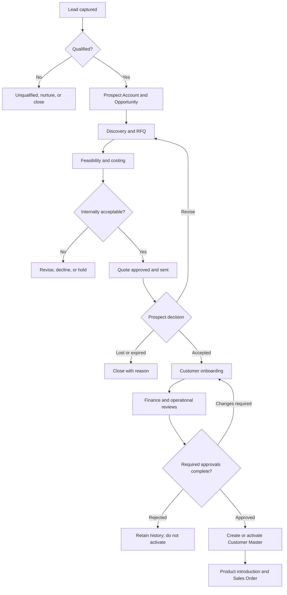
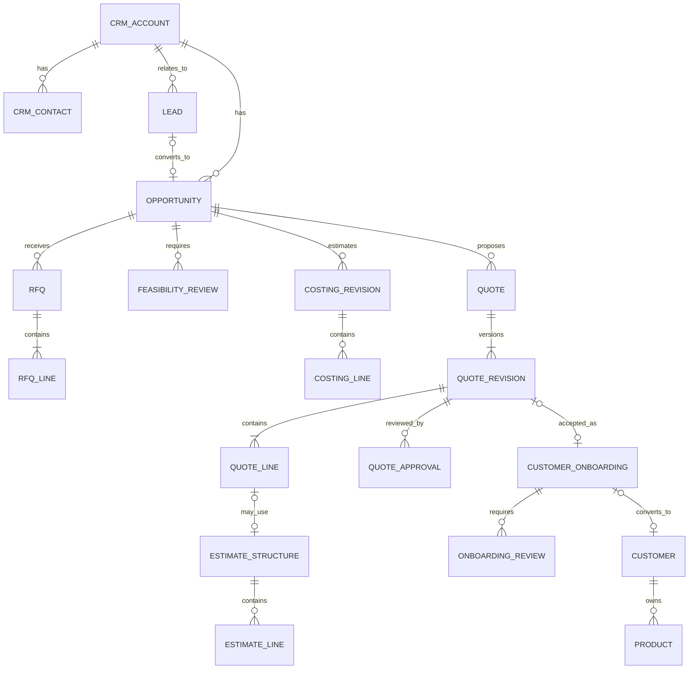

# Sales/CRM and Customer Onboarding — Workflow and Architecture

Status: Approved direction; standalone module deferred
Project phase: Early design; not yet scheduled for implementation
Owner: Product owner / Sales / Operations
Last updated: 2026-09-10
Primary purpose: Preserve the agreed pre-customer commercial journey and its
boundary with Customer Master, Products & BOM, Finance, and future Sales Orders.

Related documents:

- [Architecture index](README.md)
- [Products & BOM workflow](products-and-bom-workflow.md)
- [Roles and permissions](../auth/roles-and-permissions.md)
- [Authentication and authorization architecture](../auth/authentication-and-authorization-architecture.md)

## 1. How to use this document

This is a direction-setting reference rather than a finished PRD or API
specification. Read it before implementing Leads, Opportunities, RFQs, costing,
Quotes, Customer onboarding, or conversion into Customer Master.

When this module is resumed:

1. Confirm the open decisions before choosing database constraints.
2. Implement one vertical slice at a time from the roadmap.
3. Keep each business object’s status independent.
4. Record material decisions in the decision log.
5. Update the roles and permissions document with every introduced action.

## 2. Decision summary

The application will treat Sales/CRM as a standalone module that owns the
journey before a business becomes an active Customer.

The main decisions are:

- A Lead or Prospect is not yet a Customer.
- Prospects may have Contacts, Opportunities, RFQs, costings, and Quotes without
  appearing in operational Customer Master.
- An accepted Quote starts Customer onboarding; it does not automatically
  activate a Customer.
- Customer activation requires the agreed operational and financial checks.
- General Manager approval is policy-driven and should eventually be required
  only for defined risk, value, margin, capability, or capital thresholds.
- Workflow stages are controlled statuses; descriptive classifications are
  tags. Tags do not determine what actions are allowed.
- A quotation or estimate structure is not an approved production BOM.
- The existing Customer Master remains the source of truth after conversion.

This module is intentionally deferred while the current Products & BOM and
authorization work is completed.

## 3. Scope

### 3.1 In scope

The future Sales/CRM module owns:

- Lead capture and qualification.
- Prospect company and Contact information.
- Sales ownership and follow-up activity.
- Opportunities and commercial discovery.
- Requests for Quotation (RFQs) and Customer requirements.
- Cross-functional feasibility and preliminary costing.
- Quote preparation, internal approval, revisions, sending, and negotiation.
- Won, lost, expired, superseded, and on-hold outcomes.
- Customer-onboarding initiation after an accepted Quote or approved strategic
  decision.
- Traceable conversion from Prospect information into Customer Master.

### 3.2 Outside this module

The module does not own:

- Active Customer financial and operational master data after conversion.
- Released production Products, Parts, or BOMs.
- Sales-order fulfilment.
- Production planning and execution.
- Inventory transactions.
- Accounts receivable, invoicing, or payment collection.
- Document storage infrastructure, although CRM records may reference drawings,
  specifications, contracts, and correspondence.

### 3.3 Boundary with Customer Master

Customer Master contains organizations the company is approved to trade with.
Sales/CRM contains organizations and people the company may trade with.

The two must remain linked after conversion so users can trace an active
Customer back to the Lead, Opportunity, RFQ, accepted Quote, reviews, and
approval evidence that created it.

## 4. Core terminology

### Lead

An initial expression of possible business. Information may be incomplete and
may identify only a company, person, phone number, email address, source, and
brief need.

### Prospect Account

A potential organization that has been qualified enough to maintain as a
continuing commercial relationship. It is not an active Customer.

### Contact

A person associated with a Lead, Prospect Account, Opportunity, RFQ, Quote, or
Customer relationship.

### Opportunity

A potential piece of business with an owner, expected value, probability,
requirements, estimated timing, and outcome.

### RFQ

A Customer or Prospect request for pricing and commercial terms for one or more
items, services, or manufacturing requirements.

### Feasibility review

An internal assessment of whether the organization can manufacture, source,
inspect, deliver, and support the proposed work.

### Costing

The internal estimate of material, labour, machine time, tooling,
subcontracting, quality, freight, overhead, risk, and margin.

### Quote

A controlled commercial proposal issued to a Prospect or Customer. A Quote may
have multiple immutable revisions.

### Customer onboarding

The controlled process that collects and verifies the legal, contact,
financial, tax, compliance, operational, and approval information required to
create or activate a Customer Master record.

### Active Customer

An approved Customer Master record that may be used by downstream operational
and financial transactions, subject to holds and permissions.

## 5. Design principles

### 5.1 Do not create Customers merely to prepare a Quote

Early commercial activity must not pollute Customer Master or imply that credit,
legal, compliance, or operational approval has occurred.

### 5.2 Keep lifecycles separate

Lead status, Opportunity stage, RFQ status, Quote status, onboarding status,
and Customer operational status describe different facts. Do not implement one
large status field that attempts to represent the entire journey.

### 5.3 Use tags only for classification

Tags may describe industry, source, priority, geography, strategic importance,
capability match, or risk. Controlled statuses and approvals determine allowed
workflow actions.

### 5.4 Preserve revisions and decisions

Do not overwrite a Quote that has been approved or sent. Create a new revision
and retain the commercial values, assumptions, reviewer decisions, dates, and
documents associated with every issued version.

### 5.5 Separate preparation from approval

The person preparing a costing or Quote should not automatically approve it.
The same principle applies to Customer financial review and final activation.

### 5.6 Use approval thresholds

A General Manager should not have to approve every routine transaction forever.
Approval policy may consider value, margin, credit exposure, contractual risk,
new capability, capital expenditure, tooling, regulatory requirements, or an
exception to standard terms.

The first implementation may require final approval for every new Customer
while the business gathers enough experience to define safe thresholds.

### 5.7 Keep estimate structures separate from production BOMs

A Quote may need a preliminary material or process structure for costing. That
structure is incomplete and commercially sensitive and must not become an
ACTIVE production BOM merely because a Quote is accepted.

Conversion into Product and BOM master data requires an explicit product
introduction workflow, production validation, and BOM activation authority.

### 5.8 Preserve conversion traceability

Customer, Product, and Sales Order records created downstream must retain links
to their source Opportunity, RFQ, Quote revision, and onboarding decision.

## 6. End-to-end journey



## 7. Detailed workflow

### 7.1 Lead capture

Sales records the minimum known information:

- Company or trading name, if known.
- Contact name.
- Email and/or phone.
- Lead source.
- General requirement or interest.
- Assigned Sales owner.
- Next follow-up date.
- Notes and referenced correspondence.

Duplicate detection should warn on normalized company name, email, phone, tax
identifier, and website/domain where available.

### 7.2 Qualification

Sales confirms enough information to decide whether the Lead should progress:

- Requirement matches the company’s broad capability.
- Expected timing and quantities are plausible.
- A decision-maker or useful contact is known.
- The opportunity has a legitimate commercial purpose.
- There is no obvious legal, ethical, capacity, or credit reason to decline.

Qualification creates or links a Prospect Account and creates an Opportunity.
Unqualified Leads are retained with a reason instead of deleted.

### 7.3 Discovery and Opportunity management

Sales gathers:

- Required products or services.
- Forecast quantity and order frequency.
- Target price or commercial expectations.
- Delivery locations and requested dates.
- Drawings, specifications, samples, and revision identifiers.
- Material, process, packaging, and certification requirements.
- Expected annual value and decision date.
- Competitor or incumbent information when appropriate.

One Prospect Account may have several open or historical Opportunities.

### 7.4 RFQ preparation

An RFQ captures exactly what was requested and when. Requirements sent by the
Prospect should be preserved as received. Internal clarification must be logged
without silently rewriting the original request.

RFQ lines may describe proposed items before an internal Product code exists.
Creating an RFQ must therefore not require a Product Master record.

### 7.5 Feasibility and costing

Reviews may run in parallel:

- Production Planning or Supervision reviews process capability, labour,
  machines, tooling, capacity, setup, cycle time, and achievable delivery.
- Procurement reviews materials, suppliers, minimum order quantities, lead
  times, tooling, and subcontract services.
- Quality reviews inspection, testing, certification, traceability, Customer
  specifications, and regulatory obligations.
- Finance reviews target margin, currency, taxes, payment terms, credit
  exposure, and unusual commercial conditions.
- Operations consolidates delivery and operational risk where required.

Each reviewer records an outcome, comments, assumptions, and timestamp. A
review should be Request changes, Accepted, Accepted with conditions, or
Rejected rather than an undocumented checkbox.

### 7.6 Internal Quote approval

Sales prepares a Quote revision from approved costing and commercial inputs.
The application evaluates the approval policy.

Potential triggers for escalation include:

- Value above the delegated approval limit.
- Gross margin below the permitted threshold.
- Credit exposure above a limit.
- Non-standard payment, warranty, liability, or delivery terms.
- New process, material, supplier, tooling, or capital expenditure.
- Regulated, safety-critical, or unusually demanding Quality requirements.
- Capacity risk or conflict with committed production.

The General Manager receives the evidence and recommendations rather than
performing every specialist review personally.

### 7.7 Quote issue and negotiation

Only an approved Quote revision may be marked Sent. The system records the sent
date, recipient, validity date, currency, terms, and document revision.

Negotiated changes create another revision and repeat only the reviews affected
by the changes. Earlier sent revisions remain visible and immutable.

### 7.8 Accepted Quote

An acceptance records the accepted Quote revision, Customer evidence, date,
commercial owner, and any conditions. It marks the Opportunity Won and opens
Customer onboarding.

Acceptance does not automatically:

- Activate a Customer.
- Release a Product.
- Activate a production BOM.
- Create a Sales Order without validation.

### 7.9 Customer onboarding

The onboarding record is prefilled from the Prospect Account, Contacts, and
accepted Quote. Sales completes legal identity and operational Contacts;
Finance completes financial, tax, payment, and credit information.

Operations confirms that the approved scope can be handed into Product
introduction and order fulfilment. Additional Quality or legal review may be
required based on policy.

After required approvals, the system creates or activates the Customer Master
record and stores the source onboarding identifier.

### 7.10 Active relationship

After activation, normal changes occur in Customer Master under field-scoped
permissions. Significant changes such as legal identity, credit exposure, tax
status, or exceptional terms may require a fresh approval or invalidate an
existing approval according to future policy.

## 8. Independent status models

### 8.1 Lead status

| Status | Meaning |
| --- | --- |
| NEW | Captured but not yet contacted or assessed. |
| CONTACTED | Initial contact or attempted contact is recorded. |
| QUALIFIED | Suitable to create or join a Prospect Account and Opportunity. |
| UNQUALIFIED | Not suitable; a reason is required. |
| NURTURE | Potential future fit without a current active Opportunity. |
| CONVERTED | Converted into an Opportunity. |

### 8.2 Opportunity stage

| Stage | Meaning |
| --- | --- |
| DISCOVERY | Requirements and commercial context are being gathered. |
| RFQ_RECEIVED | A defined request is ready for internal response. |
| FEASIBILITY_COSTING | Cross-functional reviews and costing are underway. |
| QUOTE_REVIEW | A Quote revision awaits internal approval. |
| QUOTE_SENT | An approved revision has been issued. |
| NEGOTIATION | Commercial or technical changes are being discussed. |
| WON | A Quote revision has been accepted. |
| LOST | The business was not won; a reason is required. |
| ON_HOLD | Progress is intentionally paused. |

### 8.3 RFQ status

`DRAFT`, `READY_FOR_REVIEW`, `IN_REVIEW`, `COSTED`, `DECLINED`, `CLOSED`.

### 8.4 Quote revision status

`DRAFT`, `INTERNAL_REVIEW`, `APPROVED`, `SENT`, `ACCEPTED`, `DECLINED`,
`EXPIRED`, `SUPERSEDED`, `WITHDRAWN`.

### 8.5 Customer onboarding status

`DRAFT`, `IN_REVIEW`, `CHANGES_REQUIRED`, `APPROVED`, `REJECTED`, `CANCELLED`,
`CONVERTED`.

Reviewer decisions remain separate records so Finance, Operations, Quality,
and final approval can progress independently.

### 8.6 Customer operational status

Customer Master continues to own statuses such as `ACTIVE`, `ON_HOLD`, and
`INACTIVE`. Onboarding approval is evidence for activation, not a replacement
for the Customer’s operational lifecycle.

## 9. Roles and responsibilities

The initial `SALES_CUSTOMER_SERVICE` role covers Business Development, Sales,
and Customer Service duties for smaller organizations. A dedicated Business
Development or Sales Manager role may be introduced later without changing the
workflow entities.

| Role | Primary responsibility in this journey |
| --- | --- |
| Sales / Customer Service | Capture and qualify Leads; own Opportunities; gather requirements; prepare and send approved Quotes; collect onboarding identity and Contacts. |
| Production Planner | Review manufacturability, capacity assumptions, planning inputs, and preliminary Product/BOM needs. |
| Production Supervisor | Review practical execution, labour, machinery, setup, cycle time, and floor constraints. |
| Procurement / Purchasing | Review material, supplier, MOQ, lead-time, tooling, and subcontract cost assumptions. |
| Quality Control | Review inspection, testing, compliance, certification, and traceability requirements. |
| Finance / Accounts | Review margins, credit, currency, tax, payment terms, and financial onboarding fields. |
| Operations Manager | Consolidate operational feasibility, capacity, delivery risk, and exception approval. |
| Executive / General Manager | Make final strategic or threshold-based approval decisions using specialist recommendations. |
| System Administrator | Configure accounts and approved workflow policy; no automatic commercial approval authority. |

## 10. Approval model

### 10.1 Initial safe model

For the first implementation, require:

1. Sales submission.
2. Finance review.
3. Operations review.
4. General Manager final approval for a new Customer.

Quality, Procurement, Planning, or Production reviews become mandatory when the
RFQ requirements or policy trigger them.

### 10.2 Later delegated model

When thresholds are confirmed, routine low-risk work may be approved within
delegated authority. The system must calculate the required approval path from
versioned policy and store which rule triggered every approval.

Approvals must never be inferred merely because a user can edit the record.

## 11. Proposed navigation

Proposed top-level module: **Sales / CRM**

```text
Sales / CRM
├── Overview
├── Leads
│   ├── Lead Details
│   └── Qualification / Conversion
├── Prospect Accounts
│   └── Account Details
│       ├── Contacts
│       ├── Opportunities
│       ├── Activities
│       └── Documents
├── Opportunities
│   └── Opportunity Workspace
│       ├── Discovery
│       ├── RFQs
│       ├── Feasibility
│       ├── Costing
│       ├── Quotes
│       └── Activity
├── RFQs
├── Quotes
│   └── Quote Revision
└── Customer Onboarding
    └── Onboarding Workspace
        ├── Identity and Contacts
        ├── Finance
        ├── Operations
        ├── Reviews
        └── Conversion
```

Customer Master remains a separate destination for approved trading accounts.

## 12. Conceptual data model

This is a direction for later schema design, not an instruction to create all
tables at once.



Important modeling rules:

- Use normalized identifiers for duplicate detection but preserve entered
  display values.
- Store reviewer, decision, timestamp, comments, and policy trigger on approval
  records.
- Treat Quote revisions as immutable after approval or sending.
- Link conversion records instead of copying data without provenance.
- Do not link an estimate structure directly as an ACTIVE production BOM.
- Use archival or closed states rather than deleting commercial history.

## 13. Product and BOM boundary

During quotation, Products and Parts may not yet have approved internal codes.
RFQ and Quote lines therefore use commercial descriptions and optional proposed
identifiers.

An accepted Quote may start a Product-introduction request containing:

- Accepted Quote line and revision.
- Customer requirements and documents.
- Proposed Product code and description.
- Expected volumes and units per shipper.
- Preliminary materials, processes, and costing assumptions.
- Required delivery and validation dates.

Production Planning then creates controlled Product, Part, and draft BOM master
records. Existing BOM activation permissions and separation of duties remain in
force.

## 14. Permission direction

Future permission keys should describe actions rather than job titles. Likely
groups include:

- `crm.lead.view`, `crm.lead.create`, `crm.lead.edit`, `crm.lead.qualify`.
- `crm.account.view`, `crm.account.manage`.
- `crm.opportunity.view`, `crm.opportunity.manage`, `crm.opportunity.close`.
- `crm.rfq.view`, `crm.rfq.manage`, `crm.rfq.submit_review`.
- `crm.feasibility.review` and discipline-specific review permissions.
- `crm.costing.view`, `crm.costing.edit`, `crm.costing.view_margin`.
- `crm.quote.view`, `crm.quote.prepare`, `crm.quote.approve`, `crm.quote.send`.
- `crm.onboarding.view`, `crm.onboarding.prepare`,
  `crm.onboarding.review_finance`, `crm.onboarding.review_operations`,
  `crm.onboarding.approve`, `crm.onboarding.convert`.

Cost and margin visibility must remain separately controlled. `SYSTEM_ADMIN`
must not receive commercial approval authority automatically.

## 15. Audit and notification requirements

Audit history should include:

- Status and stage changes with previous and next values.
- Ownership changes.
- Qualification and closure reasons.
- Costing and Quote revision creation.
- Review requests, decisions, comments, and conditions.
- Quote issue, recipient, and accepted revision.
- Onboarding field changes and approvals.
- Customer conversion and all resulting record identifiers.

Notifications should eventually support assignments, review requests,
approaching Quote expiry, overdue follow-up, changes required, acceptance, and
onboarding completion. Notifications must not replace durable workflow state.

## 16. Current implementation boundary and UAT interpretation

The current `/products/customers` workflow creates Customer Master records
directly and does not implement the Sales/CRM or onboarding state machine.

Until this module is built:

- Treat Customer records created during UAT as already qualified, development-
  only master-data examples.
- Use the current Sales persona to test identity and Contact field permissions.
- Use the Finance persona to test financial field permissions.
- Do not interpret immediate Customer activation as the final business design.
- Do not add temporary Lead, Opportunity, RFQ, or Quote concepts to Products &
  BOM merely to imitate the deferred module.

This known gap does not invalidate the current authorization UAT; it defines a
future business workflow that will sit before Customer Master.

## 17. Phased implementation roadmap

### Phase 0 — Architecture and policy confirmation — Current

- Preserve this document.
- Confirm terminology, ownership, thresholds, and required reviews.
- Keep the module out of the current Products & BOM delivery scope.

### Phase 1 — Leads, Prospect Accounts, Contacts, and activity

- Capture, search, assign, qualify, close, and convert Leads.
- Detect likely duplicates.
- Record follow-ups and ownership.

### Phase 2 — Opportunities and RFQs

- Manage discovery and Opportunity stages.
- Record requirements and RFQ revisions/clarifications.
- Support items before Product Master creation.

### Phase 3 — Feasibility and costing

- Introduce discipline reviews and controlled cost visibility.
- Capture assumptions and preliminary estimate structures.

### Phase 4 — Quotes, revisions, and approvals

- Prepare, review, approve, issue, revise, accept, decline, and expire Quotes.
- Add threshold-based approval policy only after business rules are confirmed.

### Phase 5 — Customer onboarding and conversion

- Prefill onboarding from the accepted Quote and Prospect Account.
- Collect Finance and Operations decisions.
- Convert into Customer Master with full traceability.

### Phase 6 — Product introduction and Sales Order integration

- Hand accepted work into Product/BOM preparation.
- Convert accepted commercial lines into validated operational demand.
- Preserve source links through fulfilment.

## 18. Minimum acceptance criteria for the first usable slice

- A user can capture a Lead without creating a Customer.
- A qualified Lead can create or join a Prospect Account and Opportunity.
- Unqualified and lost outcomes require reasons and remain searchable.
- Permissions prevent unauthorized qualification, costing visibility, approval,
  Quote issue, and Customer conversion.
- Every state transition is validated on the server and audited.
- Duplicate warnings do not silently merge organizations.
- Conversion is atomic and cannot produce duplicate active Customers.
- Existing Products, Customers, and BOMs cannot be changed through an
  unauthorized CRM action.

Later-phase acceptance criteria must be added before each phase is implemented.

## 19. Open decisions

1. Does the business call the pre-customer organization a Prospect, Account, or
   Potential Customer?
2. Does a Lead always represent a person/inquiry, or can it represent a company?
3. When should a qualified Lead reuse an existing Prospect or Customer Account?
4. Which roles can see internal costs and margins?
5. Which reviews are always required and which are triggered by RFQ content?
6. What value, margin, credit, capability, and capital thresholds require
   Operations or General Manager approval?
7. Can an existing active Customer bypass full onboarding for a new
   Opportunity?
8. Which accepted changes require Quote reapproval?
9. What evidence counts as formal Quote acceptance?
10. When should a proposed item receive an internal Product code?
11. How should estimate structures convert into draft BOMs without implying
    production approval?
12. Which Customer Master changes trigger reapproval after onboarding?
13. Will email/calendar integration be introduced, and what communication must
    be retained?
14. Are Business Development and Customer Service separate roles in larger
    deployments?

## 20. Decision log

| Date | Decision | Reason |
| --- | --- | --- |
| 2026-09-10 | Implement Sales/CRM as a standalone deferred module. | Pre-customer commercial work has a different lifecycle from approved Customer Master data and should not expand the current Products & BOM scope. |
| 2026-09-10 | Permit Leads, Prospects, Opportunities, RFQs, and Quotes before Customer creation. | A company may request and negotiate work without being approved as a trading Customer. |
| 2026-09-10 | Start Customer onboarding from an accepted Quote or separately approved strategic decision. | Commercial acceptance is the appropriate handoff into legal, financial, and operational onboarding. |
| 2026-09-10 | Keep specialist reviews separate from final General Manager approval. | Planning, Production, Procurement, Quality, Finance, and Operations provide evidence within their expertise; the General Manager makes the final strategic or threshold decision. |
| 2026-09-10 | Keep Quote/estimate structures separate from ACTIVE production BOMs. | Preliminary costing data is not validated production master data and must pass Product/BOM controls. |
| 2026-09-10 | Use separate lifecycle statuses and supplemental tags. | One combined status would create invalid transitions and obscure the state of each business object. |
| 2026-09-10 | Treat current Customer authorization UAT data as already-qualified test master data. | The deferred workflow should not block verification of the field-level permissions already implemented. |

## 21. Future supporting documents

Before implementation, add or extend:

- Sales/CRM PRD and phase-specific acceptance criteria.
- Detailed workflow/state-transition specification.
- Data model and ERD validated against the existing Prisma schema.
- Approval and delegation matrix with confirmed thresholds.
- API/Server Action specification.
- Audit-event catalogue.
- Security and commercial-data visibility rules.
- Automated test and business UAT plan.
- Migration/import plan for existing Leads, Quotes, and Prospect Contacts.
