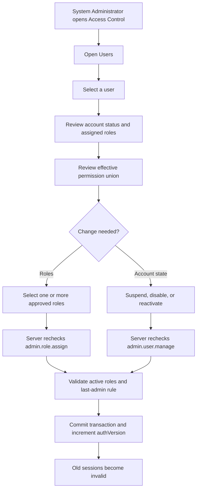

# Access Control Administration

Status: Phase 4 foundation implemented
Owner: Product owner / Engineering
Last updated: 2026-09-11

## Purpose

This document records the administration workflow for users, role assignments,
account status, and the later custom-role builder. It complements the full role
catalogue in [Roles and permissions](roles-and-permissions.md).

The goal is to support both large manufacturers with dedicated job roles and
small manufacturers where one person performs several functions. A user's
effective access is therefore the union of every active role assigned to them.

## Current implementation

Authorized System Administrators can use the following routes:

| Route | Purpose | Read permission | Change permission |
| --- | --- | --- | --- |
| `/settings/access` | Access Control overview | `admin.user.view` | None |
| `/settings/access/users` | List users, statuses, roles, and last sign-in | `admin.user.view` | None |
| `/settings/access/users/[userId]` | Inspect effective permissions | `admin.user.view` | `admin.role.assign` or `admin.user.manage` |
| `/settings/access/roles` | List role templates | `admin.user.view` | None |
| `/settings/access/roles/[roleId]` | Inspect a role's permissions | `admin.user.view` | None |

The current change operations are:

- replace an existing user's complete role set with one or more active roles;
- suspend an active user;
- reactivate a suspended or disabled user; and
- disable an active or suspended user.

User invitation, password setup, and custom-role creation are not part of this
slice. Standard roles are intentionally read-only.

## Authorization and safety rules

The administration pages improve discoverability but are not a security
boundary. Every mutation independently reloads the signed-in principal and
checks the required permission on the server.

Role changes accept only user and role identifiers. The service reloads the
target user and every selected role inside a serializable transaction. Unknown
or inactive roles are rejected, at least one role must remain assigned, and the
database computes the change rather than trusting role details sent by the
browser.

The following safeguards apply:

1. An administrator cannot change their own account status.
2. The last active user holding the active `SYSTEM_ADMIN` role cannot lose that
   role, be suspended, or be disabled.
3. Role and status changes increment the target user's `authVersion`, making
   existing sessions stale immediately.
4. A user changing their own role set is signed out after a successful change.
5. Accounts and assignments are retained; this workflow does not hard-delete
   identity or authorization history.
6. System roles remain locked so a company-specific change cannot silently
   alter the baseline templates used by another deployment.

`User.role` is temporarily maintained as a compatibility display field, but it
is not an authorization source. Server authorization resolves normalized
`UserRole`, `RolePermission`, and `Permission` records.

## User workflow



## Custom-role direction

The next Access Control slice will add custom roles without allowing companies
to invent arbitrary permission keys. The software owns the permission
catalogue; an authorized company administrator chooses from that catalogue.

Planned rules:

- create a custom role from an empty role or by duplicating a standard role;
- edit the name, description, and selected permissions of custom roles;
- never edit a standard role in place;
- show affected user count and permission differences before saving;
- archive rather than delete roles that have history;
- prevent archiving a role while it is the only source of recoverable
  administration access; and
- continue resolving multiple assigned roles additively, with deny-by-default
  when no permission grants an operation.

Approval separation, monetary thresholds, site/warehouse scope, and explicit
denies remain policy features outside the first custom-role release.

## Verification

Automated policy checks are run with:

```powershell
npm run uat:access-control
```

They cover last-administrator protection and rejected/accepted access-change
input. Database-backed authorization audits and the existing role UAT remain
required regression checks before merge.
