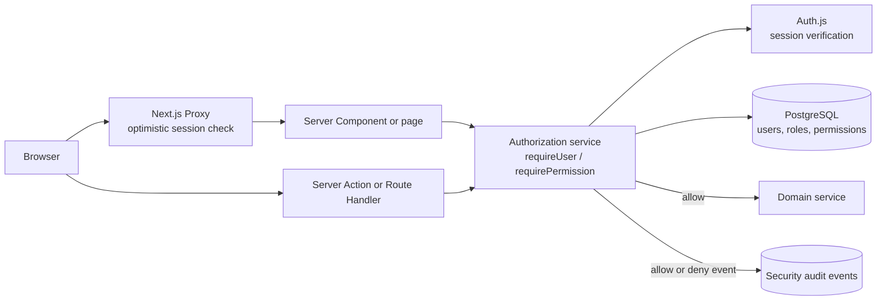
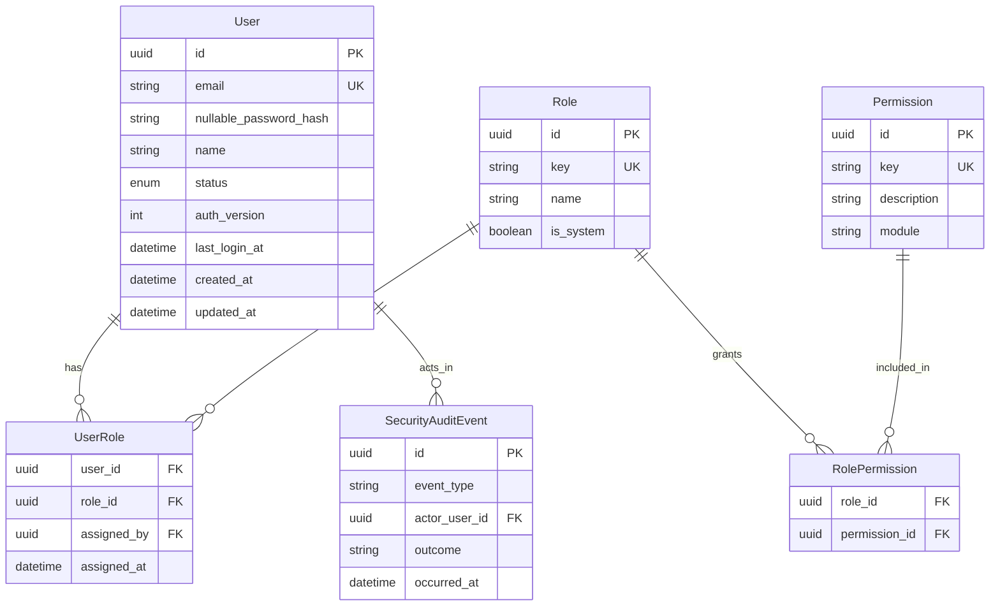
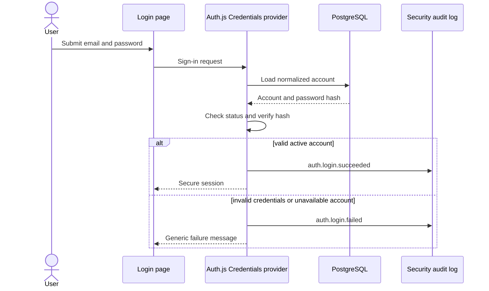

# Authentication and Authorization Architecture

Status: Approved direction; onboarding implemented and hardening remains
Owner: Product owner / Engineering
Last updated: 2026-09-12

## 1. Purpose

This document defines how the ERP will identify users, manage sessions, decide
what users may do, and protect sensitive operations. It describes both the
current implementation and the agreed target so incomplete security work stays
visible while the project is being built.

The design applies to:

- Interactive application pages.
- React Server Components and server-side data reads.
- Server Actions and Route Handlers.
- Administrative user and role management.
- Import, migration, and operational scripts where a human identity is
  available.
- Future integrations and service accounts, which require a separate credential
  type and must not impersonate human users.

## 2. Definitions

| Term | Meaning |
| --- | --- |
| Authentication (AuthN) | Verification of a user's identity |
| Session | The server-verifiable state connecting requests to an authenticated user |
| Authorization (AuthZ) | Decision that an authenticated user may perform an action |
| Role | A reusable bundle representing a business function |
| Permission | A stable capability such as `bom.activate` |
| Data scope | The records a permitted user may act upon, such as one warehouse |
| Principal | A human user or, in future, a separately identified service account |

## 3. Current implementation

As of 2026-09-09, the application has a working prototype authentication layer:

- Auth.js/NextAuth v5 beta is configured in `src/auth.ts`.
- The Credentials provider accepts email and password.
- Users and password hashes are stored in the Prisma `User` model in PostgreSQL.
- Password verification uses `bcryptjs.compare`.
- Auth.js issues JWT-based sessions.
- The session contains user ID, name, email, the compatibility role, and
  `authVersion`.
- `src/proxy.ts` redirects unauthenticated page requests to `/login`.
- Customer, Product, Part, and BOM mutations enforce typed permissions from the
  normalized RBAC model.
- The database contains 11 seeded system roles, 74 stable permissions, normalized
  role assignments, account status, normalized email, and `authVersion`.
- The existing `ADMIN` user was preserved and mapped to `SYSTEM_ADMIN`.
- Login uses normalized email, rejects non-active accounts, records
  `lastLoginAt`, and places `authVersion` in the JWT/session.
- A server-only authorization service resolves current active roles and
  permissions and exposes typed `requireUser` and `requirePermission` guards.
- Administrators with `admin.user.invite` and `admin.role.assign` can create
  invited accounts; recipients activate them with hashed 48-hour single-use links.
- The EON login validates bounded credentials on both client and server and does
  not disclose whether an account exists or is unavailable.

This provides a useful foundation, but it is not the target authorization
system.

### 3.1 Known gaps

- The legacy `User.role` string is still copied into Auth.js during the
  compatibility period, although secure permission decisions now resolve the
  normalized assignments from the database.
- Future modules and broader application navigation must adopt the normalized
  principal as they are implemented.
- JWT contents may remain valid after role or account changes.
- The central guard rejects stale JWTs at protected operations, but a complete
  logout/revocation experience for already-open pages is not yet implemented.
- No login throttling, lockout policy, production email delivery, or password
  reset flow is implemented.
- Auth and authorization events are not stored in an audit table.
- The prototype administrator may still use a development password that must be
  rotated before any shared, staging, or production deployment.
- Navigation hiding is not yet driven by effective permissions.

## 4. Target architecture

The first production-capable release will continue to use Auth.js as the
application session interface and Prisma/PostgreSQL as the source of user,
role, and permission data. Supabase currently hosts PostgreSQL; using Supabase
Auth would be a separate architectural change rather than an automatic
consequence of using Supabase Database.

The system will use database-backed role-based access control (RBAC), support
multiple roles per user, deny by default, and enforce permissions near protected
data and mutations.



### 4.1 Security boundaries

| Layer | Responsibility | Security status |
| --- | --- | --- |
| Proxy | Fast redirect for clearly unauthenticated requests | Convenience and optimistic protection only |
| Server Component/page | Request-time page and data-read authorization | Required where protected data is loaded |
| Server Action | Mutation authorization and input validation | Required for every action invocation |
| Route Handler | Request authentication, authorization, and response filtering | Required for every protected method |
| Authorization service/DAL | Resolve current user and effective permissions | Primary reusable enforcement boundary |
| Domain service/database | Invariants, transactions, and constrained writes | Must not rely on hidden buttons |
| Client UI | Hide or disable unavailable actions | User experience only |

Proxy, layouts, client session state, and hidden controls must never be the only
authorization check. Server Actions are treated as public entry points because
clients can invoke them independently of the visible page.

## 5. Identity and account lifecycle

### 5.1 Initial account model

The ERP is an internal business application. Version 1 will not offer public
self-registration. A System Administrator creates or invites a user, assigns
approved roles, and communicates an activation path through an authorized
channel.

Target account states:

```text
INVITED -> ACTIVE -> SUSPENDED -> ACTIVE
                    |
                    v
                 DISABLED
```

| State | Login | Existing sessions | Administration |
| --- | --- | --- | --- |
| `INVITED` | Not until activation is complete | None | Invitation may be reissued or revoked |
| `ACTIVE` | Allowed | Allowed while valid | Roles may be changed by an authorized administrator |
| `SUSPENDED` | Denied temporarily | Must be invalidated | May be reactivated |
| `DISABLED` | Denied | Must be invalidated | Retained for history; not hard-deleted |

Hard deletion of users is not the normal workflow because business and audit
history must continue to identify the actor.

### 5.2 Email identity

- Email addresses are normalized before lookup and uniqueness checks.
- Login failures use a generic message so they do not reveal whether an account
  exists.
- Production accounts should require verified ownership of the email or a
  controlled administrator-created identity.
- Changing a login email is a sensitive action and must be audited.

## 6. Authorization data model

Migration `20260909170000_add_auth_rbac_foundation` added the normalized records
shown below. The free-text `User.role` field remains temporarily so the current
login and mutation checks continue to work while authorization moves to the new
model. It will be removed only after every server boundary and existing user
mapping has been verified.



Detailed role definitions and permission keys live in
[roles-and-permissions.md](roles-and-permissions.md). Do not copy the catalogue
into code in multiple independent forms. Seed data and typed permission
constants must be derived from or checked against one canonical registry.

### 6.1 Multiple roles

A user may hold more than one role. Effective permissions are the union of all
active role grants. Version 1 has no explicit deny grants; absence of an allow
means denied. This avoids conflicting allow/deny precedence rules.

### 6.2 Data scope

Permission and data scope are separate decisions. Version 1 may grant access
organization-wide, but the schema and authorization API must allow future
constraints for site, warehouse, department, production line, shift, or
assigned work.

## 7. Session design

JWT sessions remain acceptable for the first implementation, subject to these
rules:

- Store only minimum identity/session claims in the token.
- Do not put password data, full role records, or a long-lived permission list in
  the client-visible session.
- Resolve effective permissions on the server for protected operations.
- Add an `authVersion` or equivalent claim and compare it with the current user
  record when a secure operation is performed.
- Increment `authVersion` when a password, account status, or role assignment
  changes, invalidating older sessions.
- Define explicit idle and absolute session lifetimes before production.
- Log out by invalidating the browser session; account suspension and privilege
  changes must also invalidate authorization without waiting indefinitely for an
  old JWT to expire.
- Authentication tokens must remain in secure, HTTP-only cookies managed by the
  auth library, not browser local storage.

If reliable immediate server-side revocation cannot be achieved with the JWT
design, record an ADR and move to database sessions before production.

## 8. Authentication flow



Login handling must apply server-side validation, a reasonable maximum password
input length, generic failures, and rate limiting by both account identifier and
network source. Logs must never contain the submitted password.

## 9. Authorization flow

Every protected read or mutation follows the same decision path:

1. Verify the session on the server.
2. Load the current user and confirm the account is `ACTIVE`.
3. Confirm the session/auth version is current.
4. Resolve effective permissions from active role assignments.
5. Check the required permission.
6. Apply any record-level data scope.
7. Validate input and execute the domain operation in the appropriate
   transaction.
8. Record a required audit event.
9. Return only fields the caller is allowed to receive.

Target helper interface:

```ts
const principal = await requirePermission("bom.activate")

// A domain service can now apply record-level scope using the returned principal.
await activateBom({ principal, productId })
```

The exact API may evolve, but it must remain centralized, server-only, typed,
and independently testable. Authorization failures must not disclose records
the user cannot view.

Implementation status as of 2026-09-10:

- `authorization-policy.ts` implements the pure, independently testable access
  decision.
- `authorization-service.ts` verifies Auth.js state and reloads current access
  from PostgreSQL.
- `authorization-user-select.ts` limits the query to identity, account state,
  roles, and permission keys; it never selects the password hash.
- Active permissions from multiple active roles are combined and deduplicated.
- Unknown, inactive, and inactive-role grants are ignored.
- Missing, stale, suspended, invited, disabled, and forbidden paths return typed
  errors with distinct `401` or `403` semantics.
- The Parts module enforces `part.view`, `part.create`, `part.edit`,
  `part.deactivate`, and `part.reactivate` before protected reads or mutations.
  Its route controls use the same effective permission result, while the Server
  Actions remain the mandatory security boundary.
- The Products module enforces Product and related BOM view permissions before
  dashboard/catalog reads. Product creation also requires draft-BOM creation;
  Product deactivation requires BOM archival. Operational master fields and
  commercial price fields are submitted and authorized independently.
- The BOM module enforces `bom.view` before list/detail reads and table fetches.
  Draft creation is separate from draft editing, and draft editing also requires
  Parts visibility because it loads the active Parts Library. Activation requires
  both `bom.activate` and `bom.archive` because the same serializable transaction
  archives the previous active revision. Production Planners prepare drafts while
  Operations Managers release them.
- The Customers module enforces `customer.view` before list/detail reads and table
  fetches. Updates submit identity, operational-contact, and financial field
  groups independently. Sales / Customer Service owns identity and contacts;
  Finance / Accounts owns credit, payment, discount, tax, currency, and
  accounts-payable email; Operations Managers control lifecycle status.

## 10. Password and recovery controls

The prototype already stores bcrypt hashes rather than plaintext passwords.
Before production, the password decision must be finalized and recorded:

- Prefer Argon2id for newly created password hashes where the deployment
  environment supports it reliably.
- If bcrypt remains, use a documented work factor of at least 10, enforce a
  maximum input length compatible with bcrypt, and plan hash upgrades on future
  successful login.
- Never encrypt passwords reversibly.
- Allow long passphrases and password-manager paste.
- Do not require arbitrary periodic password changes; require a reset after
  compromise, administrator intervention, or other risk event.
- Password reset and invitation tokens must be random, single-use, short-lived,
  stored only as hashes, and invalidated after use.
- Password change requires current-password verification or a verified recovery
  flow, then invalidates existing sessions.

Multi-factor authentication is not required for the first prototype release,
but should be evaluated before production for System Administrators and users
who approve sensitive operations.

## 11. Bootstrap administrator

The first System Administrator must be created through an explicit, recoverable,
non-public process:

1. A command or seed reads credentials from protected environment input, never
   source code.
2. It refuses weak/default credentials and refuses to print the password.
3. It is idempotent and reports whether it created or found the account.
4. It assigns only the technical System Administrator role by default.
5. It records `auth.bootstrap_admin.created`.
6. Re-running it cannot silently elevate another account.

Prototype credentials are no longer displayed on the login page or embedded in
the bootstrap script. Any existing development password must still be rotated
before a shared, staging, or production environment is used.

## 12. Audit and observability

Required security events, fields, privacy limits, and event names are defined in
[audit-events.md](audit-events.md). Authentication failures must be observable
without storing secrets. Repeated failure and access-denied patterns should be
available for alerting when production monitoring is introduced.

Business history such as BOM revision activation belongs to the broader ERP
audit model, but must include the same stable actor user ID and correlation ID
where possible.

## 13. Error behaviour

| Condition | UI behaviour | Server/API behaviour |
| --- | --- | --- |
| No valid session | Redirect to login where appropriate | `401` or typed unauthenticated result |
| Signed in but missing permission | Show unavailable state or access-denied page | `403` or typed forbidden result |
| Record outside data scope | Do not reveal existence | Prefer not-found style response where appropriate |
| Invalid credentials | Generic login failure | Record sanitized failure reason internally |
| Disabled/suspended account | Generic login failure | Record account-state denial internally |

Internal logs may distinguish sanitized reason codes, but client messages must
not enable account enumeration.

## 14. Testing requirements

Every protected capability requires:

- An unauthenticated test.
- An authenticated-and-allowed test.
- An authenticated-but-denied test.
- A multiple-role effective-permission test where relevant.
- A disabled-account/session invalidation test.
- A direct Server Action or Route Handler invocation test, not only a UI test.
- A test that sensitive fields and records are not returned on denial.
- An audit-event assertion for sensitive operations.

Authorization tests must use seeded stable permission keys, not free-text roles.

## 15. Out of scope for the first auth increment

- Public customer accounts.
- Public self-registration.
- Social login.
- External supplier portals.
- Service-to-service API keys.
- Enterprise SSO.
- Fine-grained warehouse or site scope.
- Full production MFA deployment.

These may be added later through explicit requirements and ADRs without
weakening the server-side permission boundary.

## 16. Open decisions

1. Select Argon2id or a documented bcrypt configuration for new passwords.
2. Define invitation delivery for development and production.
3. Define idle and absolute session timeouts.
4. Decide whether privilege changes invalidate all sessions immediately.
5. Decide whether staging requires MFA for administrators.
6. Define audit retention and who may export security events.
7. Confirm which role may assign business roles to users.
8. Confirm whether version 1 requires site or warehouse scope.

Open decisions must be resolved before the implementation phase that depends on
them; they do not block initial RBAC schema and centralized guard work.

## 17. References

- [Next.js authentication guide](https://nextjs.org/docs/app/guides/authentication)
- [Auth.js documentation](https://authjs.dev/)
- [OWASP Authentication Cheat Sheet](https://cheatsheetseries.owasp.org/cheatsheets/Authentication_Cheat_Sheet.html)
- [OWASP Session Management Cheat Sheet](https://cheatsheetseries.owasp.org/cheatsheets/Session_Management_Cheat_Sheet.html)
- [OWASP Password Storage Cheat Sheet](https://cheatsheetseries.owasp.org/cheatsheets/Password_Storage_Cheat_Sheet.html)

## 18. Change log

| Date | Change |
| --- | --- |
| 2026-09-09 | Recorded the current prototype, agreed normalized RBAC direction, session freshness requirement, internal user lifecycle, and enforcement boundaries. |
| 2026-09-10 | Implemented the central authorization policy/service, normalized login, authVersion session freshness, minimal access query, and core/database UAT. |
| 2026-09-10 | Applied normalized permissions to the Parts module routes and Server Actions with permission-aware controls and direct-operation UAT. |
| 2026-09-10 | Protected Product routes and actions, separated operational/commercial editing, and enforced compound BOM permissions for Product lifecycle operations. |
| 2026-09-10 | Protected BOM routes and actions, separated preparation from activation, and required archive authority for the activation transaction. |
| 2026-09-10 | Protected Customer routes and actions and split identity, contact, financial, and lifecycle controls by business ownership. |
