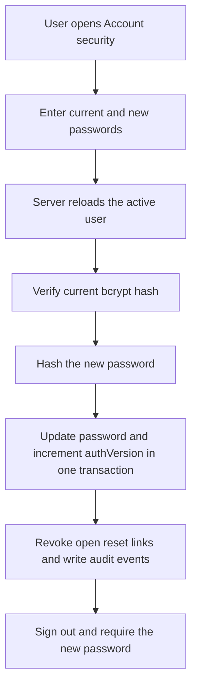
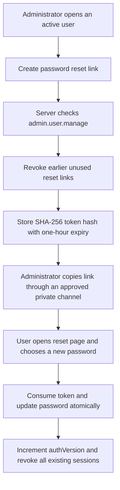

# Password Management and Recovery

Status: Implemented and manually accepted for self-service changes and administrator-delivered reset links; email delivery deferred
Owner: Product owner / Engineering
Last updated: 2026-09-14

## Purpose

Active users need a safe way to change their own password, while administrators
need a recovery mechanism that never reveals or lets them choose another
person's password. This workflow extends the invitation security pattern with
shorter-lived, hashed, single-use reset links.

## Implemented routes

| Route | Purpose | Access |
| --- | --- | --- |
| `/settings/account/security` | Change the signed-in user's password | Any active authenticated user |
| `/settings/access/users/[userId]` | Create a reset link for another active user | `admin.user.manage` |
| `/reset-password/[token]` | Validate a bearer link and choose a new password | Possession of a valid token |
| `/login` | Sign in after a successful change or reset | Public authentication route |

## Self-service password change

The current password is required even when the browser already has a valid
session. The new password must differ from the current password and follows the
same length and bcrypt byte-boundary rules as account activation.

## Administrator-assisted recovery

Administrators cannot create a reset link for invited, suspended, or disabled
accounts. They must resolve the account state first. Administrators never enter,
receive, or view the replacement password.

## Security rules

1. Reset secrets contain 256 bits of cryptographic randomness.
2. Only a SHA-256 token hash is stored in PostgreSQL.
3. Reset links expire after one hour and can be consumed once.
4. Creating a replacement link revokes all earlier unused links for that user.
5. Completing a reset revokes all other open reset links.
6. Password changes and resets increment `authVersion`, invalidating every
   existing JWT session.
7. Password, token, secret, hash, cookie, and session values are prohibited from
   audit metadata.
8. Reset pages are `noindex`, `nofollow`, and `no-referrer`.
9. An unknown, expired, used, or revoked token receives the same public message.
10. The reset workflow never changes an account's status or role assignments.
11. A successful change or reset clears temporary failed-login throttle state.
12. An administrator must enter a retained reason before issuing a password
    reset link. The reason is audit context and must not contain secrets.

## Delivery boundary

Development uses administrator-controlled delivery through an approved private
channel. A public forgot-password request is deliberately not simulated because
there is no production email provider, sender domain, anti-abuse control, or
delivery monitoring yet.

When email is selected, add a delivery adapter that receives the raw token only
in memory. The database, logs, analytics, error reporting, and audit trail must
never receive the raw link. Public recovery responses must remain identical for
known and unknown email addresses and must be rate limited.

## Audit events

- `auth.password.changed`
- `auth.password.change_failed`
- `auth.password_reset.requested`
- `auth.password_reset.completed`
- `auth.password_reset.failed`
- `auth.session.revoked` with `PASSWORD_CHANGED` or `PASSWORD_RESET`

Successful password and session-version writes share the same transaction and
correlation ID as their audit events.

## Manual acceptance scenarios

1. Every active role can open Account security and change its own password.
2. An incorrect current password is rejected and audited.
3. Weak, mismatched, unchanged, and over-72-byte passwords are rejected.
4. A successful change signs the user out; the old password fails and the new
   password succeeds.
5. An authorized administrator can issue a reset link for another active user.
6. An unauthorized user cannot issue a link by direct action invocation.
7. Creating a second link invalidates the first.
8. A valid link resets the password once; second use and expired links fail.
9. Existing sessions become stale after a completed reset.
10. Suspended, disabled, and invited accounts cannot receive or consume a reset
    link.

## Change log

| Date | Change |
| --- | --- |
| 2026-09-13 | Implemented self-service password changes, administrator-delivered reset links, transactional session invalidation, and password audit events. |
| 2026-09-13 | Product owner manually accepted current-password rejection, successful change and sign-out, old/new credential behaviour, administrator reset-link creation, single-use reset, credential restoration, and audit capture. |
| 2026-09-14 | Password change and recovery now clear temporary login throttling while preserving account status and role assignments. |
| 2026-09-14 | Administrator-issued password reset links now require a server-validated reason retained in the security audit history. |
