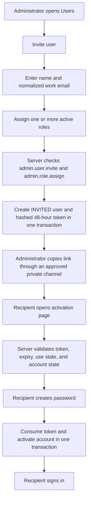

# User Onboarding and Account Activation

Status: Implemented for administrator-delivered links; email delivery deferred
Owner: Product owner / Engineering
Last updated: 2026-09-12

## Purpose

The ERP has no public registration. An authorized administrator creates an
account, assigns one or more active roles, and privately gives the intended
person a one-time activation link. The recipient—not the administrator—creates
the account password.

This keeps role approval inside Access Control while avoiding shared,
administrator-known, or spreadsheet-stored passwords during onboarding.

## Implemented workflow



Routes:

| Route | Purpose | Access |
| --- | --- | --- |
| `/settings/access/users/new` | Create an invited user and initial role assignments | `admin.user.invite` and `admin.role.assign` |
| `/settings/access/users/[userId]` | Inspect, replace, cancel, or reissue an invitation | Existing Access Control permissions |
| `/activate-account/[token]` | Validate a bearer link and create the invited user's password | Possession of a valid token |
| `/login` | Sign in after successful activation | Public authentication route |

## Security rules

1. Invitation secrets contain 256 bits of cryptographic randomness.
2. PostgreSQL stores only a SHA-256 hash of the secret; application code returns
   the raw secret only for controlled delivery and never intentionally logs it.
3. A link expires after 48 hours and can be consumed only once.
4. Reissuing a link revokes every older unused link for that account.
5. Cancelling an invitation disables the account and revokes its open links.
6. A cancelled pre-activation account can be restored only by issuing a fresh
   link. Ordinary account reactivation is not offered because it has no
   password.
7. The activation transaction consumes the token, writes the password hash,
   changes `INVITED` to `ACTIVE`, and increments `authVersion` atomically.
8. Login continues to return generic failures for unknown, invited,
   suspended, disabled, or incorrectly authenticated accounts.
9. Activation pages are marked `noindex`, `nofollow`, and `no-referrer`.
10. Administrators cannot choose or view a user's password.

## Password decision

New passwords use `bcryptjs` with cost factor 12. The accepted range is at
least 12 characters and at most 72 UTF-8 bytes, which avoids bcrypt's input
truncation boundary. Long unique passphrases and password-manager paste are
supported; arbitrary composition and periodic-rotation rules are not imposed.

This decision preserves compatibility with existing hashes and avoids adding a
native dependency during the current prototype. A future move to Argon2id or a
managed identity provider requires an ADR and a transparent hash-upgrade plan.

## Link delivery boundary

Development and the first internal release use administrator-controlled link
delivery. The administrator must use an approved private channel and treat the
link like a temporary password. Production email delivery is deliberately not
simulated: when email infrastructure is selected, add a delivery adapter that
receives the raw token only in memory and never persists or logs it. Production
access logs must also redact `/activate-account/*` paths because the URL contains
a bearer secret.

## Verification

Run the schema/policy and rollback-safe database lifecycle test with:

```powershell
npm run uat:user-onboarding
```

With `npm run dev` running and development role credentials provisioned, verify
the public and protected page boundaries with:

```powershell
npm run uat:user-onboarding-routes
```

Manual UAT must cover authorized invite, unauthorized direct access, duplicate
email rejection, reissue invalidating the old link, weak/mismatched password
rejection, successful activation and login, second-use rejection, expiry, and
cancel/restore behavior.
